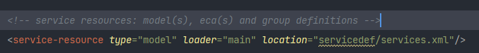

来源：https://cwiki.apache.org/confluence/display/OFBIZ/OFBiz+Tutorial+-+A+Beginners+Development+Guide

# OFBIZ 新手开发指南

## 一、下载OFBIZ源码

```
git clone https://gitbox.apache.org/repos/asf/ofbiz-framework.git ofbiz-framework
```

由于新版的OFBIZ主干被分为ofbiz-framework和ofbiz-plugins，所以原有的specailpurpose和hot-deploy目录被移除了。现在所有的组件都必须放在plugins目录中作为热部署的目录

针对当前存在的组件，使用gradle task

```
For Linux/Mac: $ ./gradlew pullAllPluginsSource
For Windows: > gradlew pullAllPluginsSource
```

或者git命令checkout出来

```
ofbiz-plugins: $ git clone https://github.com/apache/ofbiz-plugins.git plugins
```

建议使用git命令

然后reload gradle project


## 二、运行OFBIZ

```
For Linux/Mac: $ ./gradlew cleanAll loadAll ofbiz
For Windows: > gradlew cleanAll loadAll ofbiz
```

上述命令会加载demo的数据，访问https://localhost:8443/webtools，用户名admin，密码ofbiz

# 创建第一个Hello World应用

## 一、组件简介

一个OFBIZ组件是一个文件夹，包含xml文件（ofbiz-component.xml），文件描述了组件需要加载的资源

* framework components：包含给应用组件提供技术层和工具的低层次的组件；这些组件提供的特性通常和任何其他开发框架提供的特性相同（数据层、业务逻辑层、交易处理、数据源池等）
* application components：包含可扩展和定制的ERP应用（产品、订单、聚会、制造、会计等）所需的通用业务组件；application组件可以访问framework组件提供的服务和工具，以及其他应用程序组件发布的服务
* plugins components：包含的组件和application组件相似，但用于特殊的应用程序，如电子商务、google base集成、eBay集成等

## 二、创建plugin组件

使用以下命令可以轻松地创建一个plugin组件

```
$ ./gradlew createPlugin -PpluginId=ofbizDemo
```


## 三、启动第一个应用

1. 打开刚创建的文件 $OFBIZ`_HOME/plugins/ofbizDemo/widget/OfbizDemoScreens.xml` 

   ```xml
   <?xml version="1.0" encoding="UTF-8"?>
   <screens xmlns:xsi="http://www.w3.org/2001/XMLSchema-instance"
           xsi:noNamespaceSchemaLocation="http://ofbiz.apache.org/dtds/widget-screen.xsd">
       <screen name="main">
           <section>
               <actions>
                   <set field="headerItem" value="main"/><!-- this highlights the selected menu-item with name "main" -->
               </actions>
               <widgets>
                   <decorator-screen name="OfbizDemoCommonDecorator" location="${parameters.mainDecoratorLocation}">
                       <decorator-section name="body">
                      		<!-- 添加语句 -->
                           <label text="Hello World!! :)"/>
                       </decorator-section>
                   </decorator-screen>
               </widgets>
           </section>
       </screen>
   </screens>
   ```

2. 执行下面重新加载数据的命令重启OFBIZ

   ```
   ./gradlew loadAll ofbiz
   ```

   只要为你新建的组件创建了一些安全数据（默认在组件data目录中的 `OfbizDemoSecurityGroupDemoData.xml` ），就可以重启OFBIZ，ofbizdemo组件同样会被加载

3. 一旦OFBIZ重启，请求https://localhost:8443/ofbizDemo 即可访问刚才新建的组件ofbizDemo

4. 登录用户名amdin，密码ofbiz

5. 登录之后可以看到如下页面

   

   

## 四、创建第一张数据表

### 4.1 定义实体

为了在数据库中定制实体数据，你只需要在文件$OFBIZ_HOME/plugins/ofbizDemo/entitydef/entitymodel.xml中为你的应用提供实体定义。/entitydef/entitymodel.xml是在使用gradle task创建组件时自动生成的。只需要找到对应的文件并添加如下的实体定义即可。对于ofbizDemo应用组件，我们定义两个实体：

```xml
<?xml version="1.0" encoding="UTF-8"?>
  
<entitymodel xmlns:xsi="http://www.w3.org/2001/XMLSchema-instance"
    xsi:noNamespaceSchemaLocation="http://ofbiz.apache.org/dtds/entitymodel.xsd">
  
    <title>Entity of an Open For Business Project Component</title>
    <description>None</description>
    <version>1.0</version>
  
    <entity entity-name="OfbizDemoType" package-name="org.apache.ofbiz.ofbizdemo" title="OfbizDemo Type Entity">
        <field name="ofbizDemoTypeId" type="id"><description>primary sequenced ID</description></field>
        <field name="description" type="description"></field>
        <prim-key field="ofbizDemoTypeId"/>
    </entity>
  
    <entity entity-name="OfbizDemo" package-name="org.apache.ofbiz.ofbizdemo" title="OfbizDemo Entity">
        <field name="ofbizDemoId" type="id"><description>primary sequenced ID</description></field>
        <field name="ofbizDemoTypeId" type="id"></field>
        <field name="firstName" type="name"></field>
        <field name="lastName" type="name"></field>
        <field name="comments" type="comment"></field>
        <prim-key field="ofbizDemoId"/>
        <relation type="one" fk-name="ODEM_OD_TYPE_ID" rel-entity-name="OfbizDemoType">
            <key-map field-name="ofbizDemoTypeId"/>
        </relation>
    </entity>
  
</entitymodel>
```

现在看一下文件 $OFBIZ_HOME/plugins/ofbizDemo/ofbiz-component.xml，已经在其中创建了资源条目，用于加载组件时将这些实体从其定义加载到数据库

下面检验上述操作，使用命令

```
./gradlew ofbiz
```

重启OFBIZ，访问 https://localhost:8443/webtools/control/entitymaint ，搜索实体“ OfbizDemoType ”和“ OfbizDemo ”


### 4.2 准备实体数据

可以在 $OFBIZ_HOME/plugins/ofbizDemo/data目录的 **OfbizDemoTypeData.xml** 和 **OfbizDemoDemoData.xml** 中设置测试数据

 **OfbizDemoTypeData.xml** 

```xml
<?xml version="1.0" encoding="UTF-8"?>
<entity-engine-xml>
    <OfbizDemoType ofbizDemoTypeId="INTERNAL" description="Internal Demo - Office"/>
    <OfbizDemoType ofbizDemoTypeId="EXTERNAL" description="External Demo - On Site"/>
</entity-engine-xml>
```

 **OfbizDemoDemoData.xml** 

```xml
<?xml version="1.0" encoding="UTF-8"?>
<entity-engine-xml>
    <OfbizDemo ofbizDemoId="SAMPLE_DEMO_1" ofbizDemoTypeId="INTERNAL" firstName="Sample First 1" lastName="Sample Last 1" comments="This is test comment for first record."/>
    <OfbizDemo ofbizDemoId="SAMPLE_DEMO_2" ofbizDemoTypeId="INTERNAL" firstName="Sample First 2" lastName="Sample last 2" comments="This is test comment for second record."/>
    <OfbizDemo ofbizDemoId="SAMPLE_DEMO_3" ofbizDemoTypeId="EXTERNAL" firstName="Sample First 3" lastName="Sample last 3" comments="This is test comment for third record."/>
    <OfbizDemo ofbizDemoId="SAMPLE_DEMO_4" ofbizDemoTypeId="EXTERNAL" firstName="Sample First 4" lastName="Sample last 4" comments="This is test comment for fourth record."/>
</entity-engine-xml>
```

现在观察 **$OFBIZ_HOME/plugins/ofbizDemo/ofbiz-component.xml** 

 **Entry to be done in ofbiz-component.xml** 

```xml
<entity-resource type="data" reader-name="seed" loader="main" location="data/OfbizDemoTypeData.xml"/>
<entity-resource type="data" reader-name="demo" loader="main" location="data/OfbizDemoDemoData.xml"/>
```


### 4.3 加载实体中的数据

此刻应该加载实体中的数据，使用命令

```
./gradlew loadAll
```

或直接在webtools里面 https://localhost:8443/webtools/control/EntityImport 加载实体xml文件里的数据

只需要把xml数据（“ Complete XML document (root tag: entity-engine-xml): ”）放进的文本框中，并点击“Import Text”，如下图


导入文本之后，查看实体数据：https://localhost:8443/webtools/control/entitymaint


# 表单和服务

## 一、创建一个服务

在创建表单之前，我们先在 $OFBIZ_HOME/plugins/ofbizDemo/servicedef/services.xml 中编写一个向数据库中OfbizDemo实体添加数据的服务

 **services.xml** 

```xml
<?xml version="1.0" encoding="UTF-8"?>
<services xmlns:xsi="http://www.w3.org/2001/XMLSchema-instance"
        xsi:noNamespaceSchemaLocation="http://ofbiz.apache.org/dtds/services.xsd">
  
    <description>OfbizDemo Services</description>
    <vendor></vendor>
    <version>1.0</version>
  
    <service name="createOfbizDemo" default-entity-name="OfbizDemo" engine="entity-auto" invoke="create" auth="true">
        <description>Create an Ofbiz Demo record</description>
        <auto-attributes include="pk" mode="OUT" optional="false"/>
        <auto-attributes include="nonpk" mode="IN" optional="false"/>
        <override name="comments" optional="true"/>
    </service>
  
</services>
```

现在查看 ofbiz-component.xml ，已经在其中创建了资源条目，用于加载此文件中定义的服务

```xml
<!-- service resources: model(s), eca(s) and group definitions -->
<service-resource type="model" loader="main" location="servicedef/services.xml"/>
```



重启OFBIZ加载上述服务： https://localhost:8443/webtools/control/runService 


## 二、UI标签的使用（简介）

OfBiz的国际化非常容易，我们用各种语言定义UI标签，并根据用户的语言环境显示相应的标签

如下是一个UI标签的应用示例

 **OfbizDemoUiLabels.xml** 

```xml
<?xml version="1.0" encoding="UTF-8"?>
<resource xmlns:xsi="http://www.w3.org/2001/XMLSchema-instance" xsi:noNamespaceSchemaLocation="http://ofbiz.apache.org/dtds/ofbiz-properties.xsd">
    <property key="OfbizDemoApplication">
        <value xml:lang="en">OfbizDemo Application</value>
        <value xml:lang="zh">OfbizDemo应用程序?</value>
        <value xml:lang="zh-TW">OfbizDemo應用程式?</value>
    </property>
    <property key="OfbizDemoCompanyName">
        <value xml:lang="en">OFBiz: OfbizDemo</value>
        <value xml:lang="zh-TW">OFBiz: OfbizDemo</value>
    </property>
    <property key="OfbizDemoCompanySubtitle">
        <value xml:lang="en">Part of the Apache OFBiz Family of Open Source Software</value>
        <value xml:lang="it">Un modulo della famiglia di software open source Apache OFBiz</value>
        <value xml:lang="zh">开源?软件OFBiz的组成?部分</value>
        <value xml:lang="zh-TW">開源?軟體OFBiz的組成?部分</value>
    </property>
    <property key="OfbizDemoViewPermissionError">
        <value xml:lang="en">You are not allowed to view this page.</value>
        <value xml:lang="zh">不许您浏览这个页面。</value>
        <value xml:lang="zh-TW">不許您檢視這個頁面.</value>
    </property>
</resource>
```

## 三、创建添加表单

入门来创建这个service的第一个表单，在 **$OFBIZ_HOME/plugins/ofbizDemo/widget/OfbizDemoForms.xml**  中添加如下定义：

 **OfbizDemoForms.xml** 

```xml
<?xml version="1.0" encoding="UTF-8"?>
<forms xmlns:xsi="http://www.w3.org/2001/XMLSchema-instance"
       xmlns="http://ofbiz.apache.org/Widget-Form" xsi:schemaLocation="http://ofbiz.apache.org/Widget-Form http://ofbiz.apache.org/dtds/widget-form.xsd">
  
    <form name="AddOfbizDemo" type="single" target="createOfbizDemo">
        <!-- We have this utility in OFBiz to render form based on service definition.
             Service attributes will automatically lookedup and will be shown on form
        -->
        <auto-fields-service service-name="createOfbizDemo"/>
        <field name="ofbizDemoTypeId" title="${uiLabelMap.CommonType}">
            <drop-down allow-empty="false" current-description="">
                <!---We have made this drop down options dynamic(Values from db) using this -->
                <entity-options description="${description}" key-field-name="ofbizDemoTypeId" entity-name="OfbizDemoType">
                    <entity-order-by field-name="description"/>
                </entity-options>
            </drop-down>
        </field>
        <field name="submitButton" title="${uiLabelMap.CommonAdd}"><submit button-type="button"/></field>
    </form>
</forms>
```

然后再OfbizDemoScreens.xml中，将装饰器主体中的这个表单位置添加到你用来显示Hello World的屏幕上……文本。如下所示

 **Adding Form Location to the Main Screen** 

```xml
 <?xml version="1.0" encoding="UTF-8"?>
<screens xmlns:xsi="http://www.w3.org/2001/XMLSchema-instance"
         xmlns="http://ofbiz.apache.org/Widget-Screen" xsi:schemaLocation="http://ofbiz.apache.org/Widget-Screen http://ofbiz.apache.org/dtds/widget-screen.xsd">
  
    <screen name="main">
        <section>
            <actions>
                <set field="headerItem" value="main"/> <!-- this highlights the selected menu-item with name "main" -->
            </actions>
            <widgets>
                <decorator-screen name="main-decorator" location="${parameters.mainDecoratorLocation}">
                    <decorator-section name="body">
                        <screenlet title="Add Ofbiz Demo">
                            <include-form name="AddOfbizDemo" location="component://ofbizDemo/widget/OfbizDemoForms.xml"/>
                        </screenlet>
                    </decorator-section>
                </decorator-screen>
            </widgets>
        </section>
    </screen>
</screens>
```


## 四、表单的控制器条目

在 **$OFBIZ_HOME/plugins/ofbizDemo/webapp/ofbizDemo/WEB-INF/controller.xml** 中添加条目

添加如下所示的request mappings映射

```xml
<request-map uri="createOfbizDemo">
    <security https="true" auth="true"/>
    <event type="service" invoke="createOfbizDemo"/>
    <response name="success" type="view" value="main"/>
</request-map>
```

## 五、创建查找表单

1. 在OfbizDemoForms.xml中添加如下内容

   ```xml
    <form name="FindOfbizDemo" type="single" target="FindOfbizDemo" default-entity-name="OfbizDemo">
       <field name="noConditionFind"><hidden value="Y"/> <!-- if this isn't there then with all fields empty no query will be done --></field>
       <field name="ofbizDemoId" title="${uiLabelMap.OfbizDemoId}"><text-find/></field>
       <field name="firstName" title="${uiLabelMap.OfbizDemoFirstName}"><text-find/></field>
       <field name="lastName" title="${uiLabelMap.OfbizDemoLastName}"><text-find/></field>
       <field name="ofbizDemoTypeId" title="${uiLabelMap.OfbizDemoType}">
           <drop-down allow-empty="true" current-description="">
               <entity-options description="${description}" key-field-name="ofbizDemoTypeId" entity-name="OfbizDemoType">
                   <entity-order-by field-name="description"/>
               </entity-options>
           </drop-down>
       </field>
       <field name="searchButton" title="${uiLabelMap.CommonFind}" widget-style="smallSubmit"><submit button-type="button" image-location="/images/icons/magnifier.png"/></field>
   </form>
     
   <form name="ListOfbizDemo" type="list" list-name="listIt" paginate-target="FindOfbizDemo" default-entity-name="OfbizDemo" separate-columns="true"
       odd-row-style="alternate-row" header-row-style="header-row-2" default-table-style="basic-table hover-bar">
       <actions>
          <!-- Preparing search results for user query by using OFBiz stock service to perform find operations on a single entity or view entity -->
          <service service-name="performFind" result-map="result" result-map-list="listIt">
              <field-map field-name="inputFields" from-field="ofbizDemoCtx"/>
              <field-map field-name="entityName" value="OfbizDemo"/>
              <field-map field-name="orderBy" from-field="parameters.sortField"/>
              <field-map field-name="viewIndex" from-field="viewIndex"/>
              <field-map field-name="viewSize" from-field="viewSize"/>
           </service>
       </actions>
       <field name="ofbizDemoId" title="${uiLabelMap.OfbizDemoId}"><display/></field>
       <field name="ofbizDemoTypeId" title="${uiLabelMap.OfbizDemoType}"><display-entity entity-name="OfbizDemoType"/></field>
       <field name="firstName" title="${uiLabelMap.OfbizDemoFirstName}" sort-field="true"><display/></field>
       <field name="lastName" title="${uiLabelMap.OfbizDemoLastName}" sort-field="true"><display/></field>
       <field name="comments" title="${uiLabelMap.OfbizDemoComment}"><display/></field>
   </form>
   ```

2. 在OfbizDemoScreens.xml中添加form内容

   ```xml
   <!-- Find and list all ofbizdemos in a tabular format -->
   <screen name="FindOfbizDemo">
       <section>
           <actions>
               <set field="headerItem" value="findOfbizDemo"/>
               <set field="titleProperty" value="PageTitleFindOfbizDemo"/>
               <set field="ofbizDemoCtx" from-field="parameters"/>
           </actions>
           <widgets>
               <decorator-screen name="main-decorator" location="${parameters.mainDecoratorLocation}">
                   <decorator-section name="body">
                       <section>
                           <condition>
                               <if-has-permission permission="OFBIZDEMO" action="_VIEW"/>
                           </condition>
                           <widgets>
                               <decorator-screen name="FindScreenDecorator" location="component://common/widget/CommonScreens.xml">
                                   <decorator-section name="search-options">
                                       <include-form name="FindOfbizDemo" location="component://ofbizDemo/widget/OfbizDemoForms.xml"/>
                                   </decorator-section>
                                   <decorator-section name="search-results">
                                       <include-form name="ListOfbizDemo" location="component://ofbizDemo/widget/OfbizDemoForms.xml"/>
                                   </decorator-section>
                               </decorator-screen>
                           </widgets>
                           <fail-widgets>
                               <label style="h3">${uiLabelMap.OfbizDemoViewPermissionError}</label>
                          </fail-widgets>
                       </section>
                   </decorator-section>
               </decorator-screen>
           </widgets>
       </section>
   </screen>
   ```

3. 在controller.xml中添加mapping

   ```xml
   <!-- Request Mapping -->
   <request-map uri="FindOfbizDemo"><security https="true" auth="true"/><response name="success" type="view" value="FindOfbizDemo"/></request-map>
      
   <!-- View Mapping -->
   <view-map name="FindOfbizDemo" type="screen" page="component://ofbizDemo/widget/OfbizDemoScreens.xml#FindOfbizDemo"/>
   ```

4. 创建一个显示查找选项的菜单

   在OFBIZ中，所有菜单都是在*menus.xml中定义的

   在OfbizDemoMenus.xml文件中定义如下条目：

   ```xml
   <?xml version="1.0" encoding="UTF-8"?>
   <menus xmlns:xsi="http://www.w3.org/2001/XMLSchema-instance"
          xmlns="http://ofbiz.apache.org/Widget-Menu" xsi:schemaLocation="http://ofbiz.apache.org/Widget-Menu http://ofbiz.apache.org/dtds/widget-menu.xsd">
       <menu name="MainAppBar" title="${uiLabelMap.OfbizDemoApplication}" extends="CommonAppBarMenu" extends-resource="component://common/widget/CommonMenus.xml">
           <menu-item name="main" title="${uiLabelMap.CommonMain}"><link target="main"/></menu-item>
           <menu-item name="findOfbizDemo" title="${uiLabelMap.OfbizDemoFind}"><link target="FindOfbizDemo"/></menu-item>
       </menu>
   </menus>
   ```

   

## 六、UI标签的使用（完成）

 **OfbizDemoUiLabels.xml** 

```xml
<property key="OfbizDemoFind">
    <value xml:lang="en">Find</value>
</property>
<property key="OfbizDemoFirstName">
    <value xml:lang="en">First Name</value>
</property>
<property key="OfbizDemoId">
    <value xml:lang="en">OFBiz Demo Id</value>
</property>
<property key="OfbizDemoLastName">
   <value xml:lang="en">Last Name</value>
</property>
```

如上所述，Apache OFBiz的国际化非常简单，我们用各种语言定义了UI标签，并根据用户的语言环境显示了相应的标签。

这里我们完成了UI标签的例子(当创建组件时，默认创建了uilabel .xml，在我们的例子中，它是ofbizdemouilabel .xml)

现在只需重启服务器，在ofbizdemo应用程序(https://localhost:8443/ofbizDemo/control/main)下，你会看到Find菜单选项


# 使用其他引擎的服务

每当需要构建业务逻辑时， 您应该更喜欢编写服务以利用其内置服务引擎的功能 

此前新建的服务“createOfbizDemo”使用的是engine="entity-auto"，因此不需要提供它的实现，并且OFBIZ负责创建操作。当需要对包含多个实体和自定义逻辑的复杂操作的服务进行构建时，就需要提供自定义实现了。

## 一、Java实现Service

可以用Java实现Service，步骤如下：

1. 定义服务，这里同样要对上面相同的实体（OfbizDemo）进行一些操作；打开定义服务的文件 $OFBIZ_HOME/plugins/ofbizDemo/servicedef/services.xml ，并添加一条定义：

    **services.xml** 

   ```xml
    <service name="createOfbizDemoByJavaService" default-entity-name="OfbizDemo" engine="java"
           location="com.companyname.ofbizdemo.services.OfbizDemoServices" invoke="createOfbizDemo" auth="true">
       <description>Create an Ofbiz Demo record using a service in Java</description>
       <auto-attributes include="pk" mode="OUT" optional="false"/>
       <auto-attributes include="nonpk" mode="IN" optional="false"/>
       <override name="comments" optional="true"/>
   </service>
   ```

   注意这次用的engine="java"

2. 在ofbizDemo组件目录下创建src/main/java目录，并创建包"com.companyname.ofbizdemo.services"

   比如: src/main/java/com/companyname/ofbizdemo/services,那么即将创建的应用服务将在这个java目录下用Java实现
   
3. 在文件OfbizDemoServices.java文件中新建Java类,如下所示
   
    **OfbizDemoServices.java** 
   
   ```java
   package com.companyname.ofbizdemo.services;
   import java.util.Map;
     
   import org.apache.ofbiz.base.util.Debug;
   import org.apache.ofbiz.entity.Delegator;
   import org.apache.ofbiz.entity.GenericEntityException;
   import org.apache.ofbiz.entity.GenericValue;
   import org.apache.ofbiz.service.DispatchContext;
   import org.apache.ofbiz.service.ServiceUtil;
     
   public class OfbizDemoServices {
     
       public static final String module = OfbizDemoServices.class.getName();
     
       public static Map<String, Object> createOfbizDemo(DispatchContext dctx, Map<String, ? extends Object> context) {
           Map<String, Object> result = ServiceUtil.returnSuccess();
           Delegator delegator = dctx.getDelegator();
           try {
               GenericValue ofbizDemo = delegator.makeValue("OfbizDemo");
               // Auto generating next sequence of ofbizDemoId primary key
               ofbizDemo.setNextSeqId();
               // Setting up all non primary key field values from context map
               ofbizDemo.setNonPKFields(context);
               // Creating record in database for OfbizDemo entity for prepared value
               ofbizDemo = delegator.create(ofbizDemo);
               result.put("ofbizDemoId", ofbizDemo.getString("ofbizDemoId"));
               Debug.log("==========This is my first Java Service implementation in Apache OFBiz. OfbizDemo record created successfully with ofbizDemoId:"+ofbizDemo.getString("ofbizDemoId"));
           } catch (GenericEntityException e) {
               Debug.logError(e, module);
               return ServiceUtil.returnError("Error in creating record in OfbizDemo entity ........" +module);
           }
           return result;
       }
   }
   ```
   
4. 使用命令
   
   ```
   ./gradlew ofbiz
   ```
   
   重启OFBIZ，系统将自动编译新建的服务类并在重启OFBIZ时自动更新jar文件
   
5. 测试新增的服务，访问 https://localhost:8443/webtools/control/runService，或简单地更新controller请求调用的服务名称以使用此服务，并且再应用程序中使用之前准备好的添加表单
   
   
   
      

为了确保服务运行，可以在控制台中添加日志信息

```java
Debug.log("my first Java Service implementation in Apache OFBiz. OfbizDemo record created successfully with ofbizDemoId: ......");
```

测试新建服务：createOfbizDemoByJavaService


查看日志信息


## 二、Groovy实现Service

# 事件

## 一、事件演示

OFBIZ中的事件只是用来处理HttpServletRequest和HttpServletResponse对象的简单方法

不需要像对服务那样提供这些定义，它们直接从controller调用

当你想要向输入参数添加自定义服务器验证时，事件也非常有用

对于执行数据库操作，你仍然从事件中调用预构建的服务

构建OFBIZ事件的步骤如下：

1. 在包中添加一个新的event目录并新建一个Events类：

   

   **OfbizDemoEvents.java** 

   ```java
   package com.companyname.ofbizdemo.events;
   
   import javax.servlet.http.HttpServletRequest;
   import javax.servlet.http.HttpServletResponse;
   
   import org.apache.ofbiz.base.util.Debug;
   import org.apache.ofbiz.base.util.UtilMisc;
   import org.apache.ofbiz.base.util.UtilValidate;
   import org.apache.ofbiz.entity.Delegator;
   import org.apache.ofbiz.entity.GenericValue;
   import org.apache.ofbiz.service.GenericServiceException;
   import org.apache.ofbiz.service.LocalDispatcher;
   
   public class OfbizDemoEvents {
   
    public static final String module = OfbizDemoEvents.class.getName();
   
       public static String createOfbizDemoEvent(HttpServletRequest request, HttpServletResponse response) {
           Delegator delegator = (Delegator) request.getAttribute("delegator");
           LocalDispatcher dispatcher = (LocalDispatcher) request.getAttribute("dispatcher");
           GenericValue userLogin = (GenericValue) request.getSession().getAttribute("userLogin");
   
           String ofbizDemoTypeId = request.getParameter("ofbizDemoTypeId");
           String firstName = request.getParameter("firstName");
           String lastName = request.getParameter("lastName");
   
           if (UtilValidate.isEmpty(firstName) || UtilValidate.isEmpty(lastName)) {
               String errMsg = "First Name and Last Name are required fields on the form and can't be empty.";
               request.setAttribute("_ERROR_MESSAGE_", errMsg);
               return "error";
           }
           String comments = request.getParameter("comments");
   
           try {
               Debug.logInfo("=======Creating OfbizDemo record in event using service createOfbizDemoByGroovyService=========", module);
               dispatcher.runSync("createOfbizDemo", UtilMisc.toMap("ofbizDemoTypeId", ofbizDemoTypeId,
                       "firstName", firstName, "lastName", lastName, "comments", comments, "userLogin", userLogin));
           } catch (GenericServiceException e) {
               String errMsg = "Unable to create new records in OfbizDemo entity: " + e.toString();
               request.setAttribute("_ERROR_MESSAGE_", errMsg);
               return "error";
           }
           request.setAttribute("_EVENT_MESSAGE_", "OFBiz Demo created succesfully.");
           return "success";
       }
   }
   ```

2. 在controller中添加请求调用事件

     **controller.xml** 

    ```xml
     <request-map uri="createOfbizDemoEvent">
        <security https="true" auth="true"/>
        <event type="java" path="com.companyname.ofbizdemo.events.OfbizDemoEvents" invoke="createOfbizDemoEvent"/>
        <response name="success" type="view" value="main"/>
        <response name="error" type="view" value="main"/>
    </request-map>
    ```

3. 重启服务，编译步骤1中添加的事件类

4. 测试事件，你可以简单地改变AddOfbizDemo表单的target字段为“createOfbizDemoEvent”，当它被提交时，它会调用你的事件。https://localhost:8443/ofbizDemo/control/main


## 二、事件和服务的区别

* 事件用于使用映射处理器的验证和转换，而服务用于CRUD操作等业务逻辑
* 服务返回映射
* 事件返回字符串
* 服务与服务器一起加载，定义中的任何更改(如果在MiniLang中不是实现)都需要重新加载
* 我们可以在事件内部调用服务。但是我们不能在服务内部调用事件
* 事件是特定的局部块功能，通常用于一个地方，用于一个目的，并从其位置调用
* 服务是一种功能，可以位于网络上的任何地方，大多数时间在几个不同的地方使用，并以其“名称”来调用
* 在发生事件的情况下，您可以访问HttpServletRequest和HttpServletResponse对象，您可以读取/写入任何您想要的内容。对于服务，您只能访问服务参数

| 标准               | 服务                         | 事件            |
| ------------------ | ---------------------------- | --------------- |
| 是否需要定义       | 是                           | 否              |
| 实现方式           | Entity Auto, Java,XML&Groovy | Java,XML&Groovy |
| 返回类型           | Map                          | String          |
| 是否需要写业务逻辑 | 是                           | 否              |
| 是否可以作业调度   | 是                           | 否              |

