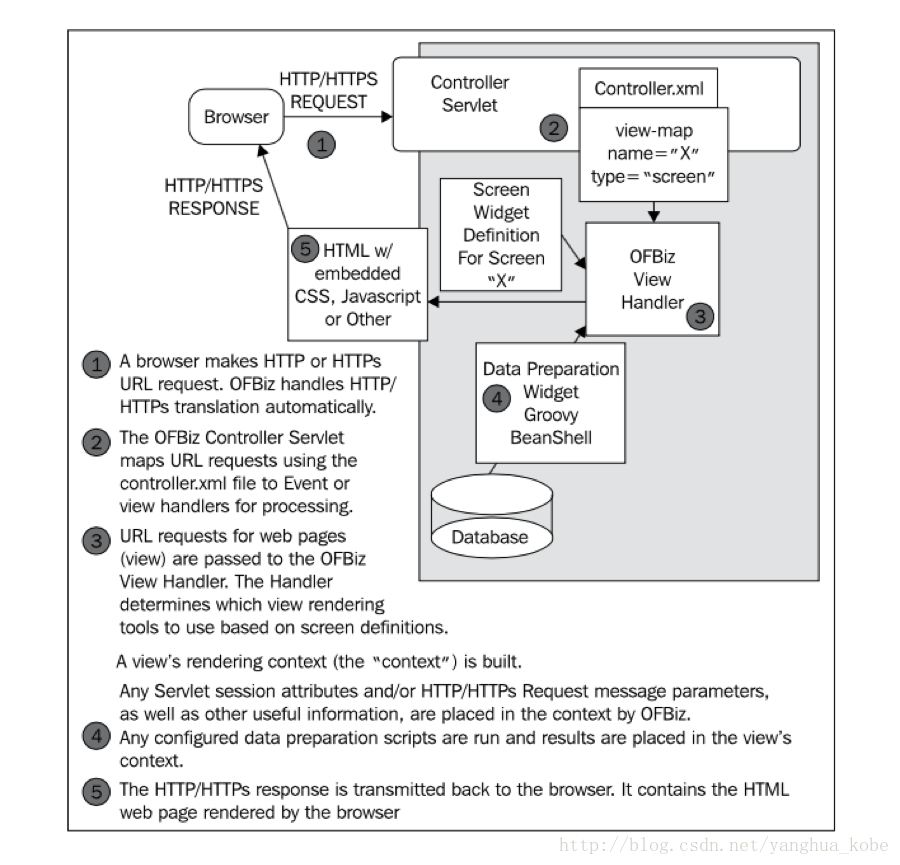

# OFBIZ

## 一、基本介绍

OFBiz是一个很著名的电子商务平台，是一个很著名的开源项目，提供了创建基于最新J2EE/XML规范和技术标准，构建大中型企业级、跨平台、跨数据库、跨应用server的多层、分布式电子商务类WEB应用系统的框架。 OFBiz最基本的特点是OFBiz提供了一整套的开发基于Java的web应用程序的组件和工具。

包含实体引擎, 服务引擎, 消息引擎, 工作流引擎, 规则引擎等。

OFBiz 已经正式成为Apache 的顶级项目: Apache OFBiz。

Ofbiz是 Open Source 的商务软件系统，充分利用了各优秀的的Open Source 项目。像 Tomcat, Ant,BeanShell,  Jboss 等，构建了一个强大的系统平台，Ofbiz 已经完毕了大部分商务类软件系统都须要的部件，像用户认证、工作流、商务规则处理等。

### 1.1 参考资料

The Data Model Resource Book，数据模型资源手册， 是建设企业信息化系统时数据建模的宝典，第一卷讲一些通用的数据模型，比如个人与组织，产品，订单，订单配送，发票，财务，人力资源等。卷二是一些特定行业的数据模型，在卷一的基础上会有所变化，比如制造业，电信，金融，保险，医疗，旅游业，电子商务等。 

### 1.2 核心架构


从上图可以看出OFBiz的所有app及plugin都是构建在Framework之上的，Framework的核心就是Service Engine(服务引擎)和Entity Engine(实体引擎)，实体引擎负责对数据库的访问，封装了对具体数据库访问的细节，和主流Mybaties、Hibernate等ORM框架类似，OFBiz的实体引擎实现使得OFBiz的支持的数据库多达12个，用户还可以自定义扩展实现对接其他数据库。OFBiz通过定义HTTP Service 来支持远程服务的调用，没有实现RPC接口调用

## 二、使用OFBIZ的好处

* 缩短开发周期，降低成本
* 架构设计先进，不仅用到了几乎所有的J2EE核心设计模式，还实现了工作流、业务规则引擎以处理灵活的变更
* OFBIZ已经完成了大部分业务类软件系统需要的部件，如用户认证、工作流、业务规则处理等，很多业务需求都可以通过写XML配置文件，以及很少的Java代码来完成。代码量不大，但知道怎么写会比较费时。弄懂Ofbiz以后，写实现代码通常会比较简单，只需要按照它的开发机制度就是了 
* 扩展性和移植性好，OFBIZ系统框架是一个纯Java的应用程序。框架提供的接口十分的完备，例如核心部件实体引擎，早期版本就有，已经十分的成熟。通过实体引擎，用户不用直接操纵数据库，建立库表、查询、视图、触发器等都可以通过写XML配置文件来完成 

## 三、MVC模式实现

Ofbiz最大的价值，也许就是它不仅仅是一个技术框架，更是一个实现企业应用得很好的业务框架。它的MVC模式不仅仅是Web层，而是贯穿于业务层和数据层，每一层都有出色的控制器

### 3.1 数据层控制器 Entity Engine

实体引擎是Ofbiz最有价值、最核心的、也是最稳定的一个数据层控制器，通过它基本不用编码或很少编码就可以访问数据层。Ofbiz提供了用XML配置文件的方法来操纵数据

实体引擎的功能类似于CICS、实体EJB、以及其他O-R Mapper。但是，Ofbiz的实体引擎不仅强大、而且灵活，程序员不需要JDBC知识，不用写SQL代码。基本上，实体引擎的封装能够解决绝大部分的数据库操作，同时，也提供了给你写SQL代码，实现复杂SQL查询的空间

实体引擎采用了不少核心J2EE设计模式，如值对象、代表、助手等模式，用户的API接口比较友好

### 3.2 逻辑层控制器 Service Engine

服务引擎是Ofbiz的另一个核心组件。Ofbiz只有这两个核心组件。实体引擎代表业务数据，而服务引擎代表了业务逻辑

引入服务引擎的另一个价值是，它使得Ofbiz业务框架不限于Web应用。非Web的客户端包括java 应用、EJB、甚至SOAP都可以直接调用，这样，框架的可扩展性非常好。

服务引擎的服务可以分为同步、异步（关心还是忽略结果），支持JMS（Java Message Service）

### 3.3 Web层控制器

Web层控制器的核心是Control Servlet。和Struts一样，Web层的流控制器的配置文件也是一个XML文件


## 四、技术串联

### 4.1 组件交互及衔接



* 第一步：浏览器向web服务器发送请求，请求被web容器接收并作相应的处理（如封装参数）
* 第二步：请求被路由到一个代理servlet中，该servlet会分析请求是发往哪个app的，然后再到该项目的controller.xml配置文件中去匹配request-map配置项，该配置项用于指示OFBIZ如何处理这个请求。通常是先进行安全检查和权限确认，然后出发某个“事件”或服务调用，最后会以一个view作为响应。如果是以view作为响应的话，OFBIZ会去view-map中匹配该视图，每一个view都有对应的handler
* 第三步：OFBIZ会用配置的handler来处理该view。handler的作用主要是用于渲染页面元素，并将需要展示的数据和页面元素合并
* 第四步：数据准备，主要是业务逻辑，是代码量占比大的地方
* 第五步：OFBIZ的view handler通过模板引擎绑定页面元素与数据后，渲染出最终的输出流，通过http响应给浏览器

### 4.2 页面渲染

OFBIZ使用XML+Widget的布局，将页面切分成单个Widget以增强各个Widget的灵活性以及复用性


这些widget可以互相嵌套形成一个decorator-widget产生模板，在widget可以直接编写html标签，或者引用各种服务端模板引擎支持的模板文件（比如freemaker）

前端的内容通常是HTML+数据。widget并没有忽略数据这部分。只是一种布局技术，它最终会由webcontainer转化为html，只不过数据的处理（CRUD）通常位于服务器端。而这些动作都被抽象成为了widget中的“action”。一个screen通常包含各种其他组件widget的引用，这些组件widget可以是：form，screen，menu等

### 4.3 权限检查

OFBIZ中采用的是角色+安全组的授权模型


从图中可以看出常用的几个权限有：_ADMIN（管理员权限）,_VIEW（浏览权限，为最小权限）,_CREATE（创建权限），_UPDATE（编辑权限）,_DELETE（删除权限）。因此如果controller.xml中配置了授权检查时，将会进行上图的权限检查流程。一个请求在处理之前，会检查其是否需要先进行登录。如果登录验证通过，会获取该会员的security group。而security group又是security permission的集合。进而可以判断用户是否有某个操作的权限

### 4.4 请求事件

因为OFBiz使用了公共代理的servlet，因此对每个请求而言，其处理逻辑就没有独享的servlet了。这里OFBiz引入了Event的机制来处理每个请求需要执行的特定的操作逻辑


每收到一个请求，如果有特殊的处理，就触发一个event。上图是event的触发机制。它的配置在controller.xml文件下的request-map配置项内 

### 4.5 服务引擎

OFBiz执行服务基于其自身实现的服务引擎框架。该服务引擎借鉴了《CoreJ2EE Pattern》里的“BusinessDelegate”模式 


调用程序通过服务引擎框架调用服务后，服务引擎首先将调用服务的参数提取并构建服务调用的上下文。然后选择合适的dispatcher，它其实就是businessdelegate。由他选择合适的引擎来执行服务。OFBiz会先判断服务有没有“特殊性”，比如它是否是异步的？是否是递归执行的。如果是，那么会选择它内置的JobScheduler来执行。还有它是否是带SECA（ServiceEvent Control Action）的？如果是SECA，那么会先执行SECA然后选择已配置的特定引擎来执行真正的目标服务，而在这个过程中会有一个Map来充当执行的上下文，用于存储中间结果、错误信息以及最终结果。执行完成之后，上下文对象会在调用栈中层层回退，并将最终的执行结果返回给调用端

### 4.6 服务事件控制响应器

所谓SECA是Service Event Control Action的单词首字母的缩写形式。可以简单得理解成“服务编排”（可能会执行多个服务，但是某些服务需要满足特定的执行条件） 


比如上面一个带SECA的服务X，在服务引擎执行之前，会先处理其ECA（这里先调用一个action，它需要执行服务B）。当ECA处理完成之后，会将控制权返回给执行引擎。执行引擎会根据服务B的执行结果来判断是否会调用真正的服务X。SECA被用于在OFBiz中替代了其原有的规则引擎以及工作流引擎，可见其灵活性是足以满足复杂业务支撑的

## 五、目录结构

### 5.1 applications目录

包含OFBIZ核心的应用程序组件，如订单管理、电子商务存储等

component-load.xml中配置需要载入的应用程序组件，每一个组件都是一个基于OFBIZ构建的web应用程序

### 5.2 framework目录

包含OFBIZ框架的组件，例如实体引擎和服务引擎，是OFBIZ框架的核心，其他应用程序都是基于它来构建的

## 六、实体数据

### 6.1 概况

* 一些实体定义在/applications/datamodel/entitydef下

* 对于特殊用途的组件，实体定义在特定组件下的“entitydef”下
* 每个组件下的data文件夹里存放了实体对应的示例数据

### 6.2 可扩展性模式

OFBIZ数据模型中，有一种模式会经常重复出现，这是为了使数据模型更具灵活性，并消除可能必须存在的大量表

与可扩展性模式相关的实体有：

* EntityClass（可选）
* EntityType
* EntityAttribute
* EntityTypeAttr

#### 6.2.1 EntityType

EntityType用来描述一个实体，如果在给定EntityType实例的parentTypeId字段中指定了父EntityType，则给定EntityType可以从父EntityType继承特征。如果一个表与给定的EntityType实例关联，该实例与entityTypeId字段值同名，则hasTable字段的值应为“Y”，否则其值应为“N”。描述字段用于EntityType实例的简短描述

#### 6.2.2 EntityAttribute

EntityAttribute是用来存放给定实例属性键值对实例的。属性可以用来代替实体表上的列，尤其是当属性不适用于所有类型的实体时。属性还可以特别用于应用于给定实体实例的任何名称-值对信息。如果一个给定的EntityType应用了许多属性，那么最好创建一个单独的实体来保存这些属性，并将该实体与EntityType实例关联，方法是将其命名为entityTypeId，并在EntityType实例上将hasTable字段设置为“Y”。这将比重复查询给定实体实例的属性集合更快

#### 6.2.3 EntityTypeAttr

EntityTypeAttr用于指定与给定entityTypeId对应的实体实例应该存在哪些属性。将列出entityTypeId和name字段组合来指定这一点。例如，entityTypeId为“BOX”的EntityType应该始终具有名为“HEIGHT”、“WIDTH”、“DEPTH”和“COLOR”的属性，因此每个属性都有一个EntityTypeAttr实例。
对于某些实体，这种模式有一些变化，但这种描述通常适用于这种数据模型。请注意，数据模型的默认类型seed数据位于*Data.xml文件中，通常位于每个组件的data目录中

#### 6.2.4 Deprecated Entities

不推荐使用前缀为“Old”的实体。通过显式指定相应的表名，基础表名保持不变

在显著更改实体时，尤其是在更改主键时，请始终弃用现有实体并创建一个新实体，以便为现有数据库提供升级路径。为了促进这一点，除了弃用旧实体（前缀为“old”）和定义新实体之外，您应该始终创建一个服务，将数据从旧实体移动到新实体。该服务不需要确定何时自己运行（这很难确定，而且通常不可靠），通常应该手动运行。


在弃用实体时，请确保搜索对该实体的所有引用，并将其更改为使用新实体。在流程结束时，对不推荐使用的实体的唯一引用（当然带有“Old”前缀）应该是迁移服务。

当更改字段名，或弃用和替换不需要弃用整个实体的字段时，请遵循相同的模式保留旧字段：在字段名中添加“old”前缀，将原始首字母改为大写，并指定字段的列名，使其与原始字段名相同。例如，如果要将“uomId”字段更改为新名称，则将字段名称更改为“oldUomId”，并指定“UOM_ID”的列名。就像替换和实体一样，确保编写一个服务将数据从旧字段移动到新字段

### 6.3 包目录

* Common：common包意味着包含通用的实体，并且可能被许多其他包中的实体使用
  * common.geo
  * common.period
  * common.status
  * common.uom
* Party：party包旨在包含与Party实体相关的实体。有许多类型的party，以及许多与一个或多个party相关的数据，这些数据在这个包中定义。当事人包括个人、组织等。
  * party.party
* Product：product包包含了与产品实体相关的实体。有许多类型的产品，以及许多与产品或产品相关的数据，这些数据在这个包中定义。产品可以是商品，也可以是服务，每种产品都可能有不同的子类型。一些对产品定义相当重要的相关数据包括功能和类别。类别包允许对产品进行组织，功能包描述了可用于定价或参数化产品搜索的产品的详细信息；product包还包含有关序列化和非序列化库存项目的信息，以及库存在仓库、商店或其他设施中的存储。有一个用于产品成本估算的包，还有一个用于产品价格计算的包
  * product.product：包含关于产品的一般信息
  * product.category：包含有关产品类别的信息，可用于组织产品进行编目、营销、分析和其他用途
  * product.feature
  * product.cost
  * product.price
  * product.inventory
  * product.storage
  * product.supplier
* Security：包含与控制对使用数据模型的应用程序各个部分的访问相关的实体。登录包有一个UserLogin实体，其中包含系统上所有用户的用户名和密码，并且可以选择与一个Party实体实例相关。登录包还有一个实体，它保存登录系统的历史记录。SecurityGroup包包含用于将SecurityPermission映射到用户登录名的实体。它将用户登录映射到SecurityGroup，然后将SecurityGroup映射到SecurityPermission。通过这种方式，可以高效地共享复杂的安全定义
  * security.login
  * security.securitygroup


## 九十九、框架熟悉进度

### 99.1 实体引擎 

2022.3.21：阅读数据层引擎文档：https://cwiki.apache.org/confluence/display/OFBIZ/Entity+Engine+Guide

2022.3.22：阅读实体概览：https://cwiki.apache.org/confluence/display/OFBIZ/General+Entity+Overview

* 实体引擎（Entity Engine）设计目标：简化实体数据在企业（enterprise）范围内的使用，包括数据定义（definition）、维护（maintenance）、质量保证（quality assurance）和开发。在事务应用程序多的领域中尽可能消除对特定实体持久性代码的需求

* 实体引擎中使用的模式：业务委托（business delegate）、值对象、复合实体（composite entity）、值对象汇编程序、服务定位器和数据访问对象（data access object），在《 Core J2EE Patterns 》中都有描述

* 实体定义不是编写实体中的代码，而是从XML中读取。这些XML实体定义指定所有实体及其字段的名称，以及它们对应的数据库表和列，还有对应的数据类型

* 添加新的实体时，要先对其进行建模。OFBIZ中是通过2个XML配置文件来完成的，一个用于实体建模，一个用于字段类型建模。因为字段类型定义可以是特定于数据库的，所以需要2给XML配置文件来完成

* 主要实体模型XML文件可以在/framework/common/entitydef中找到

* 实体数据必须从数据文件中加载，这些文件可以是SQL脚本或者XML实体引擎文件，所有类型信息和其他预加载信息（如状态、枚举、地理数据等）都位于/framwork/common/data中

* 实体定义示例

  ```xml
  <entity title="Sample Entity"
              copyright="Copyright (c) 2001 John Doe Enterprises"
              author="John Doe" version="1.0"
              package-name="org.ofbiz.commonapp.sample"
              entity-name="SampleEntity"
              table-name="SAMPLE_ENTITY">
        <field name="primaryKeyFieldOne" col-name="PRIMARY_KEY_FIELD_ONE" type="id"></field>
        <field name="primaryKeyFieldTwo" type="id"></field>
        <field name="fieldOne" type="long-varchar"></field>
        <field name="fieldTwo" type="long-varchar"></field>
        <field name="foreignKeyOne" type="id"></field>
        <prim-key field="primaryKeyFieldOne" />
        <prim-key field="primaryKeyFieldTwo" />
        <relation type="one" rel-entity-name="OtherSampleEntity">
          <key-map field-name="foreignKeyOne" rel-field-name="primaryKeyOne" />
        </relation>
        <relation type="one" title="Self" rel-entity-name="SampleEntity">
          <key-map field-name="primaryKeyFieldOne" />
          <key-map field-name="primaryKeyFieldTwo" />
        </relation>
        <relation type="many" title="AllOne" rel-entity-name="SampleEntity">
          <key-map field-name="primaryKeyFieldOne" />
        </relation>
      </entity>
  ```

* col-name和table-name是可选的

* 视图实体模型

  * 视图实体的字段是原始实体上字段的别名，视图实体的元数据几乎与普通实体的元数据相同。它有名称、包装、描述、版权、作者、版本等。它没有表名，因为它没有映射到数据源中的单个关系表。与任何普通实体一样，视图实体也必须分配给实体组XML文件中的组。视图实体中的所有成员实体必须位于同一数据库中，但不一定位于同一实体组中

* 视图链接

  * 用于只当视图和成员实体间的链接

* 从用户的角度，只有3个类真正需要理解： GenericDelegator, GenericValue and GenericPK

  * GenericDelegator类通常与实例名“delegator”一起使用，用于对GenericValue对象执行创建、查找、存储和其他操作

* 创建、存储和删除

  * 创建（插入）：使用GenericValue或GenericDelegator对象的create方法
  * 存储（更新）：使用GenericValue或GenericDelegator对象的store或storeAll方法
  * 删除：实体的删除通过delegator或GenericValue上的remove方法完成

* 查找

  * 可以使用findByPrimaryKey方法从数据库检索值实例，也可以使用findAll或findByAnd方法检索集合