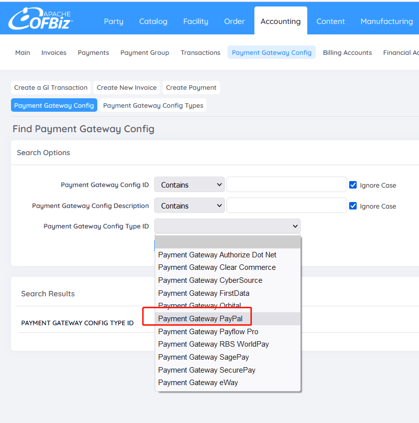
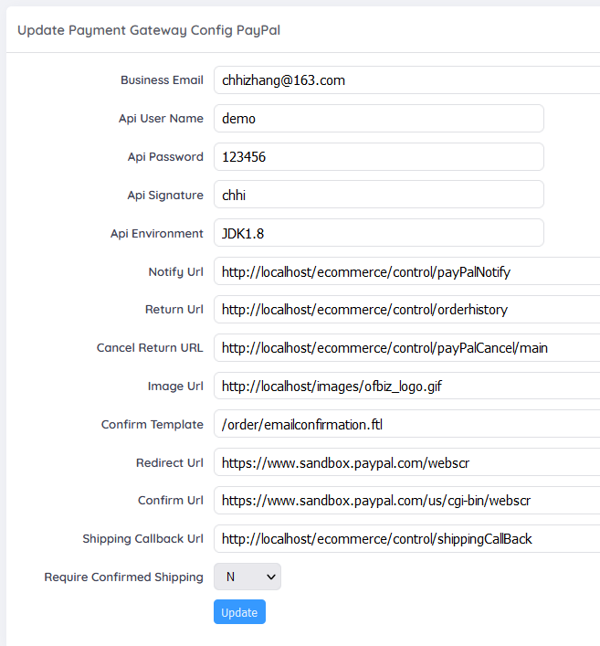
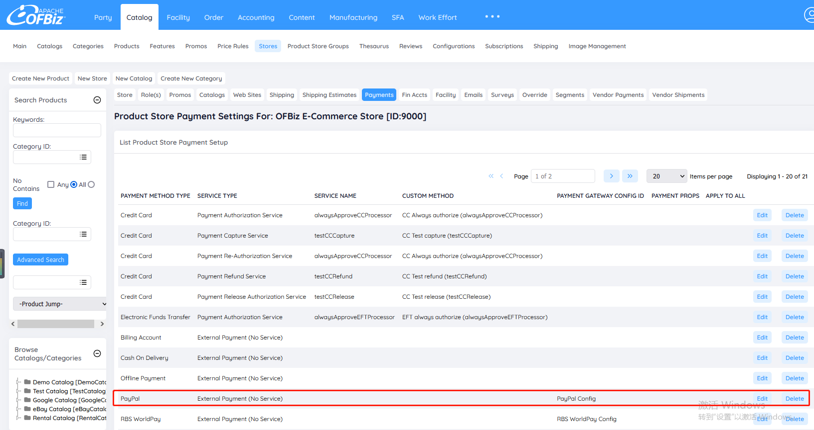
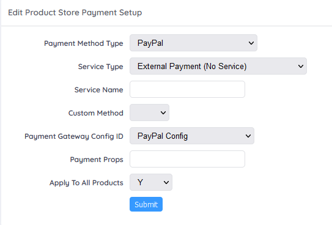

# OBFIZ支付
## Store Payment Settings
* 此页面用于配置OFBIZ中各种付款方式类型的付款处理设置
* 在demo数据中，可以看到为所有支付方式配置了测试服务，包括Credit Card, Electronic Funds Transfer (EFT), PayPal, WorldPay, and Gift Cards
* 删除所有“alwaysApprove*”和“test*”服务引用非常重要，因为它们将允许虚假付款通过
* 假设您想使用它们，唯一可以保留的演示配置是 PayPal 和 WorldPay 设置。 这些不使用可配置服务，因此配置更简单
* 要设置信用卡（和某些其他支付类型）处理，只需指定用于以下每个流程的服务：
  * Payment Authorization Service（授权）
  * Payment Capture Service（捕获）
  * Payment Re-Authorization Service（再授权）
  * Payment Refund Service（退款）
  * Payment Release Authorization Service（放行授权）
* OFBiz 包含的所有支付处理服务定义都在 ${ofbiz install dir}/applications/accounting/servicedef 目录中
* 可以重点以CyberSource为例进行研究：For CyberSource see the service definitions in the services_cybersource.xml file. This includes these services: cyberSourceCCAuth, cyberSourceCCCapture, cyberSourceCCRelease, cyberSourceCCRefund, and cyberSourceCCCredit

## Payment Processor Details
* 虽然支付服务和高级设置在Catalog Manager的Store部分配置，但各种支付处理服务的详细配置在文件中配置：
```
${ofbiz install dir}/applications/accounting/config/payment.properties
```
* 在上述文件中有许多针对每种支付流程服务的注释
* 如果使用任何支付卡支付处理器，请务必检查并在必要时更改遵循一下模式的payment.properties文件开头附近的属性
```
payment.general.reauth.*.days
```

## PayPal Payment Setup
* 以PayPal支付为例进行配置说明
1. Go to Accounting - Payment Gateway Config and select "PayPal Payment Gateway" from the list
2. Please fill all those fields to made working correctly to work with PayPal:


* Business Email : Email address of your business
* Notify URL : PayPal Notify URL (example (http://yourServerName/ecommerce/control/payPalNotify)
* Return URL : PayPal Return URL (example (http://yourServerName/ecommerce/control/orderhistory)
* Cancel Return URL : PayPal Return On Cancel URL (example http://yourServerName/ecommerce/control/payPalCancel/main)
* Image URL : Image To Use On PayPal (example (http://yourServerName/images/ofbiz_logo.gif)
* Confirm Template : Thank-You / Confirm Order Template (example /order/emailconfirmation.ftl)
* Redirect URL : PayPal Redirect URL (Sandbox http://www.sandbox.paypal.com/us/cgi-bin/webscr Production https://www.paypal.com/cgi-bin/webscr)
* Confirm URL : PayPal Confirm URL (Sandbox https://www.sandbox.paypal.com/us/cgi-bin/webscr Production http://www.paypal.com/cgi-bin/webscr)

3.  Once PayPal Payment Gateway has been configurated you have to go to Catalog - Stores - select your Store - Payments tab 

4.  Edit the Payment Method Type Paypal and choose as Payment Gateway Config Id "PayPal Config". 

   

5.  As deprecated use you can alternatively change the configuration parameters into 

   ```
   ${ofbiz install dir}/applications/accounting/config/payment.properties
   ```

   * The ones that always need to be changed for use of PayPal are: 
     *  payment.paypal.business - set to an email address on your PayPal account 
     *  payment.paypal.notify - just change domain name and port to the production values you are using 
     *  payment.paypal.return - set to the URL where you want PayPal to send  customers once payment is complete, typically back to your ecommerce web site 
     *  payment.paypal.cancelReturn - set to the URL where you want PayPal to send customers when they cancel their payment 
     *  payment.paypal.image - set to the URL of the image or logo you want  PayPal to display to help customers know that the payment is being  received on your behalf 

   * The other properties beginning with "payment.paypal." can be set, but  unless you know what you are doing we recommending leaving them as-is. （ 以“payment.paypal”开头的其他属性。 可以设置，但除非您知道自己在做什么，否则我们建议您保持原样 ）

   * 除了 payment.properties 文件中的设置外，您还必须在 PayPal 网站上更改您帐户中的一项设置，以便将通知发送回 OFBiz 以验证付款 

## CyberSource Payment Setup
* 以CyberSource支付为例进行配置说明
1. Put cybsclients15.jar, cybssecurity.jar and xalan.jar from CyberSource SDK in the directory in
```
${ofbiz install dir}applications/accounting/lib/cybersource.
```
2. Change the accounting build.xml and comments to not exclude verisign sources like here :
```xml
<!- <exclude name="org/ofbiz/accounting/thirdparty/cybersource/**"/> ->
```
* 未找到build.xml，估计是版本更新了
3. Confirm that applications/accounting/build/classes/org/ofbiz/accounting/thirdparty/cybersource/IcsPaymentServices.class was built and exists
4. The installation of certificate is requested and you can follow the instructions into the CyberSource Certificate Update manual.
5. Go to Accounting - Payment Gateway Config and select "CyberSource Payment Gateway" from the list
6. Please fill all those fields to made working correctly to work with CyberSource:
7. 参见_https://cwiki.apache.org/confluence/display/OFBENDUSER/Apache+OFBiz+Business+Setup+Guide#ApacheOFBizBusinessSetupGuide-PayflowProPaymentSetup