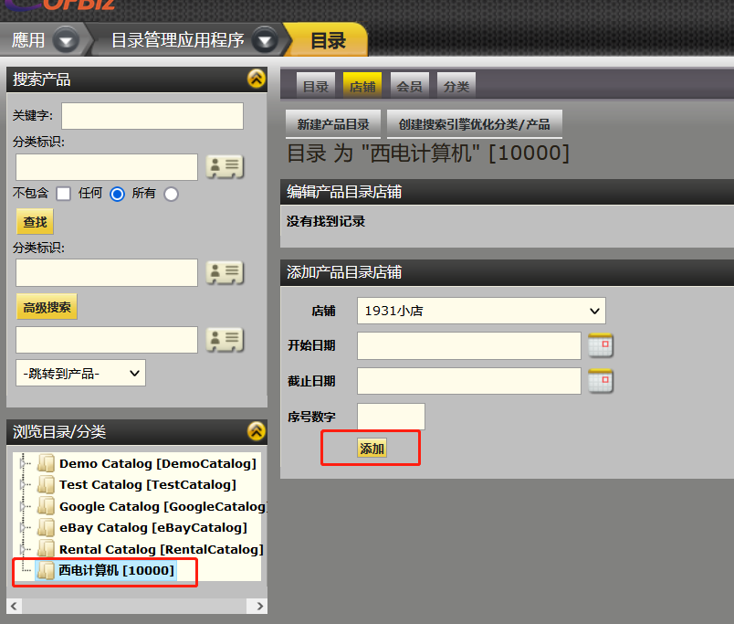
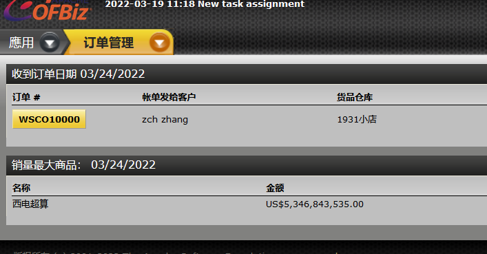

# OFBIZ销售流程

https://localhost:8443/ecommerce/control/viewprofile

```
罗：你先构造一个产品，然后把它发布到商城上，再以客户登陆购买一次，你构造的商品，生产的时候会采购供应商的一个部件，你在bom中把它构造成这样，这样当用户下单，支付之后，你开始生产这个产品，就需要采购供应商的部件，就会有支付给供应商。这样你就有收款，有支付，完成了一次全流程。在财务模块会体现这两笔交易。
```

```
物料清单（Bill of Material，Bom），采用计算机辅助企业生产管理，首先要使计算机能够读出企业所制造的产品构成和所有要涉及的物料，为了便于计算机识别，必须把用图示表达的产品结构转化成某种格式，这种以数据格式来描述产品结构的文件就是物料清单，即是Bom。它是定义的技术文件，因此，它又称为产品结构表或产品结构树。在某些工业领域，可能称为“配方”、“要素表”或其它名称 
```

在OFBIZ中商品的管理是由目录管理应用(Catalog)来完成的。从后台商品上下架到前台商品展示，都由这一应用来管理 

## 一、产品组织结构

OFBIZ通过店铺、目录、分类、下级分类、商品五种不同类别对整个产品进行管理。形成一个倒树形结构 


## 二、构造产品并发布

### 2.1 配置目录

进入产品管理应用程序，点击主目录上的“新建目录” 


创建新产品目录


### 2.2 关联目录到店铺

在浏览目录中选择刚才添加的目录，在点击“店铺”选项卡，进行绑定



### 2.3 创建分类

我们将创建四个分类：

*  一个浏览根分类

* 一个属于浏览根分类的顶级浏览分类

* 一个促销分类

* 一个全部产品分类，同时作为缺省搜索分类、允许购买分类和允许浏览

  *请确认每个产品都在“浏览”分类中，并且在“全部产品”分类中以便能在你的目录中搜索、浏览和购买* 

### 2.4 发布促销产品

进入产品管理应用程序，点击“新建分类”


#### 2.4.1 新建促销分类


**请注意，建立任一级分类时，都不使用主要上级分类域，而是在分类创建后在“汇总”里确定。这样便于以后作调整**，一旦创建了分类，转到“内容”标签，你可以在页面底部的“替代简单域”中设置“描述”，如果需要的话还可以设置“大段描述”

#### 2.4.2 将促销分类关联到目录

点击“浏览目录”中的“西电计算机”这个目录， 然后点“分类”在出现的页面中“把分类添加到这个目录”。一定要把产品目录分类类型设置为“促销（一个）” 


添加促销分类到目录成功


#### 2.4.3 新建促销产品

要创建一个产品，请遵照类似设置分类的过程。

1)    进入产品管理应用程序，转到目录管理的首页，然后点击“新建产品”。

2)    如果你填入了一个ID，系统会确认这个ID可用。如果可用，会使用这个ID。如果你没有指定ID，系统会产生一个。

3)    为产品设置一个易于记忆的内部名称。这个名称会在管理工具中显示，但不会显示给客户。

4)    请注意，如果你使用UPS或USPS或其它在线费率估算，那么你必须填写"Weight"和"Weight Uom Id"数据项。

5)    提交表单以创建产品。

6） 点击“创建产品”后，会出现很多与产品相关的配置菜单。在菜单中页面中价格。在这个页面中，可以为商品设置不同的价格。同一个商品可以被标出多个价格 


7）设置商品店铺信息

在菜单中页面中“内容”。在这个页面中，可以设置商品在网店中显示的详细信息，这里的信息是给客户看的

#### 2.4.4 将产品关联到促销分类中

点击“浏览产品分类”中的“打折促销”分类，然后在“添加产品到产品分类”中进行操作 


 至此产品就成功发布到了“1931小店”的“促销”中了。可以在ecommerce中看到它了 


### 2.5 发布非促销产品

每个分类下面还可以有子类。当上级分类的类型为“浏览根”时，网店页面上显示它所有的下级子类,点击下级子类，即可以查看这些子类里的商品了。在这种情况下，对“非促销商品的浏览了 

#### 2.5.1 新建“苹果手机”目录

进入产品管理应用程序，点击主目录上的“新建分类” 


#### 2.5.2 将分类关联到目录

点击“浏览目录”中的“西电计算机”这个目录，然后点“分类”在出现的页面中“把分类添加到这个目录”。一定要把产品目录分类类型设置为“浏览根（一个）” 


注：“浏览根”为会显示在网店中，只有它的下级分类会显示在页面上。 

#### 2.5.3 新建下级分类（一级分类）

同样新建分类，但要指定上级产品分类为“iphone”


指定上级产品分类


#### 2.5.4 将一级分类汇总到顶级分类

点击“汇总”，在“添加下级产品分类”中将一级分类（iPhone6s）汇总到顶级分类中 


 至此分类结构就形成了，刷新页面可以看到页面上显示了“浏览产品分类”。点击这里的分类即可查看相应的商品了 


查看商品分类


## 三、以客户身份购买商品

客户登录页面：https://localhost:8443/ecommerce/control/viewprofile

请求订单后查看



查看订单详情


接收支付


