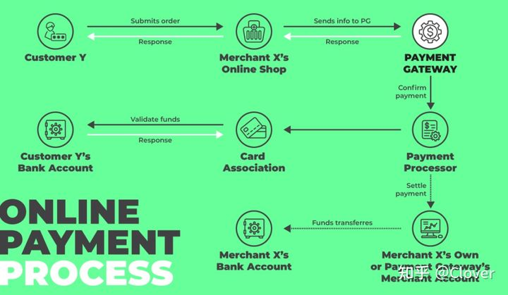

# Payment Gateway

## 一、概念

* 从技术角度说，支付网关是指商户用于接收顾客线上付款的软件。 虽然大多数在线支付通常是信用卡交易，但支付网关能够做到将不同的支付方式（如电子钱包或最近兴起的加密支付等）组合到一个统一的界面中，这样无论顾客选择哪种支付方式，支付网关都能为其提供完美的支付体验。 

## 二、运作流程

* 当顾客在购物车内放入他们心仪的商品后，就会来到结账处——也就是付款过程开始的地方。虽然整个支付过程只需几秒钟，但在后台发生的事情可能看起来相当复杂 

  

1. 