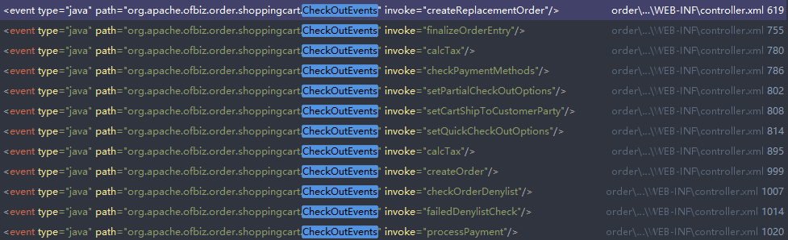
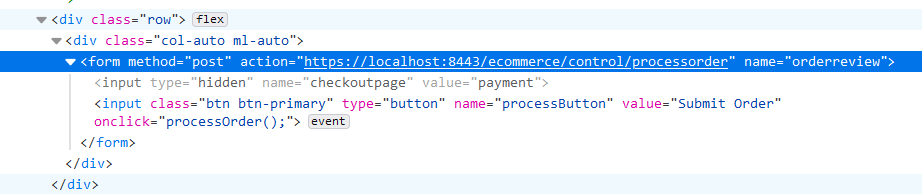

# 发起订单流程

1. 登录商城

   ```
   https://localhost:8443/ecommerce/control/main
   ```

   注：商城的controller配置文件在

   ```
   plugins/ecommerce/webapp/ecommerce/WEB-INF/controller.xml
   ```

2. 选择商品加入购物车

3. 选择[View Cart]查看购物车内容

4. 点击[Check out]拉起订单，日志信息如下

   ```
   2022-04-24 15:17:07,102 |jsse-nio-8443-exec-1 |ConfigXMLReader               |I| controller loaded: 0.002s, 290 requests, 96 views in file:/E:/my_projects/ofbiz-framework/plugins/ecommerce/webapp/ecommerce/WEB-INF/controller.xml
   2022-04-24 15:17:07,108 |jsse-nio-8443-exec-1 |RequestHandler                |I| Ran Event [java:org.apache.ofbiz.order.shoppingcart.CheckOutEvents#setCheckOutPages] from [request], result is [payment]
   ```

5. 选择支付方式[How shall you pay?]，选择[Pay With Paypal]

6. 点击[Continue to Final Order Review]，查看日志信息

   ```
   2022-04-24 15:21:20,985 |jsse-nio-8443-exec-6 |ControlServlet                |T| [[[ecommerce::checkoutoptions (Domain:https://localhost)] Request Begun, encoding=[UTF-8]- total:0.0,since last(Begin):0.0]]
   2022-04-24 15:21:21,002 |jsse-nio-8443-exec-6 |ConfigXMLReader               |I| controller loaded: 0.002s, 290 requests, 96 views in file:/E:/my_projects/ofbiz-framework/plugins/ecommerce/webapp/ecommerce/WEB-INF/controller.xml
   2022-04-24 15:21:21,005 |jsse-nio-8443-exec-6 |CheckOutEvents                |I| CheckoutPage: payment
   2022-04-24 15:21:21,005 |jsse-nio-8443-exec-6 |CheckOutEvents                |I| Selected Payment Methods : {EXT_PAYPAL={amount=null}}
   2022-04-24 15:21:21,011 |jsse-nio-8443-exec-6 |ShoppingCart                  |I| Returned new PaymentInfo - Pm: null / PmType: EXT_PAYPAL / Amt: null / Ref: null!null
   2022-04-24 15:21:21,014 |jsse-nio-8443-exec-6 |RequestHandler                |I| Ran Event [java:org.apache.ofbiz.order.shoppingcart.CheckOutEvents#setCheckOutPages] from [request], result is [confirm]
   2022-04-24 15:21:21,015 |jsse-nio-8443-exec-6 |RequestHandler                |I| [RequestHandler.doRequest]: Response is a chained request. Hidden sessionId by default.
   2022-04-24 15:21:21,016 |jsse-nio-8443-exec-6 |RequestHandler                |I| [RequestHandler]: Chain in place: requestUri=calcShipping overrideViewUri=null Hidden sessionId by default.
   2022-04-24 15:21:21,395 |jsse-nio-8443-exec-6 |ServiceDispatcher             |T| Sync service [ecommerce/productPromoCondGeoID] finished in [379] milliseconds
   2022-04-24 15:21:21,400 |jsse-nio-8443-exec-6 |ServiceDispatcher             |T| Sync service [ecommerce/productPromoCondPromoRecurrence] finished in [5] milliseconds
   2022-04-24 15:21:21,529 |jsse-nio-8443-exec-6 |ServiceDispatcher             |T| Sync service [ecommerce/getOrderedSummaryInformation] finished in [128] milliseconds
   2022-04-24 15:21:21,529 |jsse-nio-8443-exec-6 |ServiceDispatcher             |T| Sync service [ecommerce/productPromoCondOrderHist] finished in [129] milliseconds
   2022-04-24 15:21:21,531 |jsse-nio-8443-exec-6 |ServiceDispatcher             |T| Sync service [ecommerce/productPromoCondProductTotal] finished in [2] milliseconds
   2022-04-24 15:21:21,532 |jsse-nio-8443-exec-6 |ServiceDispatcher             |T| Sync service [ecommerce/productPromoCondProductAmount] finished in [1] milliseconds
   2022-04-24 15:21:21,863 |jsse-nio-8443-exec-6 |ServiceDispatcher             |T| Sync service [ecommerce/productPromoActProdAMDISC] finished in [329] milliseconds
   2022-04-24 15:21:21,865 |jsse-nio-8443-exec-6 |ServiceDispatcher             |T| Sync service [ecommerce/productPromoActProdPrice] finished in [2] milliseconds
   2022-04-24 15:21:21,867 |jsse-nio-8443-exec-6 |ServiceDispatcher             |T| Sync service [ecommerce/productPromoCondProductQuant] finished in [2] milliseconds
   2022-04-24 15:21:21,868 |jsse-nio-8443-exec-6 |ServiceDispatcher             |T| Sync service [ecommerce/productPromoActProdDISC] finished in [1] milliseconds
   2022-04-24 15:21:21,869 |jsse-nio-8443-exec-6 |ProductPromoCondServices      |I| Doing order total compare: orderSubTotal=59.9900
   2022-04-24 15:21:21,869 |jsse-nio-8443-exec-6 |ServiceDispatcher             |T| Sync service [ecommerce/productPromoCondOrderTotal] finished in [1] milliseconds
   2022-04-24 15:21:21,871 |jsse-nio-8443-exec-6 |ServiceDispatcher             |T| Sync service [ecommerce/productPromoCondProductQuant] finished in [2] milliseconds
   2022-04-24 15:21:21,872 |jsse-nio-8443-exec-6 |ServiceDispatcher             |T| Sync service [ecommerce/productPromoActProdPrice] finished in [1] milliseconds
   2022-04-24 15:21:21,874 |jsse-nio-8443-exec-6 |ServiceDispatcher             |T| Sync service [ecommerce/productPromoCondProductAmount] finished in [1] milliseconds
   2022-04-24 15:21:21,875 |jsse-nio-8443-exec-6 |ServiceDispatcher             |T| Sync service [ecommerce/productPromoCondProductTotal] finished in [1] milliseconds
   2022-04-24 15:21:21,878 |jsse-nio-8443-exec-6 |ServiceDispatcher             |T| Sync service [ecommerce/getOrderedSummaryInformation] finished in [2] milliseconds
   2022-04-24 15:21:21,878 |jsse-nio-8443-exec-6 |ServiceDispatcher             |T| Sync service [ecommerce/productPromoCondOrderHist] finished in [3] milliseconds
   2022-04-24 15:21:21,882 |jsse-nio-8443-exec-6 |ServiceDispatcher             |T| Sync service [ecommerce/productPromoCondPromoRecurrence] finished in [4] milliseconds
   2022-04-24 15:21:21,883 |jsse-nio-8443-exec-6 |ProductPromoCondServices      |I| Doing order total compare: orderSubTotal=53.9900
   2022-04-24 15:21:21,883 |jsse-nio-8443-exec-6 |ServiceDispatcher             |T| Sync service [ecommerce/productPromoCondOrderTotal] finished in [1] milliseconds
   2022-04-24 15:21:21,884 |jsse-nio-8443-exec-6 |ServiceDispatcher             |T| Sync service [ecommerce/productPromoCondProductQuant] finished in [1] milliseconds
   2022-04-24 15:21:21,885 |jsse-nio-8443-exec-6 |ServiceDispatcher             |T| Sync service [ecommerce/productPromoActProdPrice] finished in [1] milliseconds
   2022-04-24 15:21:21,888 |jsse-nio-8443-exec-6 |ServiceDispatcher             |T| Sync service [ecommerce/productPromoCondProductAmount] finished in [2] milliseconds
   2022-04-24 15:21:21,889 |jsse-nio-8443-exec-6 |ServiceDispatcher             |T| Sync service [ecommerce/productPromoCondProductTotal] finished in [1] milliseconds
   2022-04-24 15:21:21,891 |jsse-nio-8443-exec-6 |ServiceDispatcher             |T| Sync service [ecommerce/getOrderedSummaryInformation] finished in [2] milliseconds
   2022-04-24 15:21:21,891 |jsse-nio-8443-exec-6 |ServiceDispatcher             |T| Sync service [ecommerce/productPromoCondOrderHist] finished in [2] milliseconds
   2022-04-24 15:21:21,894 |jsse-nio-8443-exec-6 |ServiceDispatcher             |T| Sync service [ecommerce/productPromoCondPromoRecurrence] finished in [3] milliseconds
   2022-04-24 15:21:21,894 |jsse-nio-8443-exec-6 |ProductPromoCondServices      |I| Doing order total compare: orderSubTotal=53.9900
   2022-04-24 15:21:21,895 |jsse-nio-8443-exec-6 |RequestHandler                |I| Ran Event [java:org.apache.ofbiz.order.shoppingcart.shipping.ShippingEvents#getShipEstimate] from [request], result is [success]
   2022-04-24 15:21:21,895 |jsse-nio-8443-exec-6 |RequestHandler                |I| [RequestHandler.doRequest]: Response is a chained request. Hidden sessionId by default.
   2022-04-24 15:21:21,895 |jsse-nio-8443-exec-6 |RequestHandler                |I| [RequestHandler]: Chain in place: requestUri=calcTax overrideViewUri=null Hidden sessionId by default.
   2022-04-24 15:21:21,895 |jsse-nio-8443-exec-6 |RequestHandler                |I| Ran Event [java:org.apache.ofbiz.order.shoppingcart.CheckOutEvents#calcTax] from [request], result is [success]
   2022-04-24 15:21:21,896 |jsse-nio-8443-exec-6 |RequestHandler                |I| [RequestHandler.doRequest]: Response is a chained request. Hidden sessionId by default.
   2022-04-24 15:21:21,896 |jsse-nio-8443-exec-6 |RequestHandler                |I| [RequestHandler]: Chain in place: requestUri=validatePaymentMethods overrideViewUri=null Hidden sessionId by default.
   2022-04-24 15:21:21,896 |jsse-nio-8443-exec-6 |RequestHandler                |I| Ran Event [java:org.apache.ofbiz.order.shoppingcart.CheckOutEvents#checkPaymentMethods] from [request], result is [success]
   2022-04-24 15:21:21,896 |jsse-nio-8443-exec-6 |RequestHandler                |I| Rendering View [checkoutreview].  Hidden sessionId by default.
   2022-04-24 15:21:21,897 |jsse-nio-8443-exec-6 |ServiceDispatcher             |T| Sync service [ecommerce/getUserPreferenceGroup] finished in [1] milliseconds
   2022-04-24 15:21:21,905 |jsse-nio-8443-exec-6 |ScreenFactory                 |I| Got 37 screens in 0.005s from: file:/E:/my_projects/ofbiz-framework/plugins/ecommerce/widget/OrderScreens.xml
   2022-04-24 15:21:22,091 |jsse-nio-8443-exec-6 |ShoppingCartItem              |I| Setting orderItemSeqId - 00001
   2022-04-24 15:21:22,146 |jsse-nio-8443-exec-6 |ScreenFactory                 |I| Got 17 screens in 0.005s from: file:/E:/my_projects/ofbiz-framework/plugins/ecommerce/widget/CommonScreens.xml
   2022-04-24 15:21:22,417 |jsse-nio-8443-exec-6 |ScreenFactory                 |I| Got 9 screens in 0.007s from: file:/E:/my_projects/ofbiz-framework/plugins/ecommerce/widget/CartScreens.xml
   2022-04-24 15:21:22,534 |jsse-nio-8443-exec-6 |UtilProperties                |I| ResourceBundle AccountingEntityLabels (en_US) created in 0.093s with 357 properties
   2022-04-24 15:21:22,593 |jsse-nio-8443-exec-6 |ServerHitBin                  |I| Visit delegatorName=default, ServerHitBin delegatorName=default
   2022-04-24 15:21:22,597 |jsse-nio-8443-exec-6 |ControlServlet                |T| [[[ecommerce::checkoutoptions (Domain:https://localhost)] Request Done- total:1.612,since last([ecommerce::check...):1.612]]
   
   ```

7.  点击[Submit Order]，提交订单，查看日志信息如下：

   ```
   2022-04-24 15:25:30,088 |jsse-nio-8443-exec-2 |ControlServlet                |T| [[[ecommerce::processorder (Domain:https://localhost)] Request Begun, encoding=[UTF-8]- total:0.0,since last(Begin):0.0]]
   2022-04-24 15:25:30,105 |jsse-nio-8443-exec-2 |ConfigXMLReader               |I| controller loaded: 0.002s, 290 requests, 96 views in file:/E:/my_projects/ofbiz-framework/plugins/ecommerce/webapp/ecommerce/WEB-INF/controller.xml
   2022-04-24 15:25:30,113 |jsse-nio-8443-exec-2 |ShoppingCart                  |I| Creating OrderPaymentPreference - [GenericEntity:OrderPaymentPreference][billingPostalCode,null()][finAccountId,null()][manualAuthCode,null()][manualRefNum,null()][maxAmount,53.99(java.math.BigDecimal)][overflowFlag,N(java.lang.String)][paymentMethodId,null()][paymentMethodTypeId,EXT_PAYPAL(java.lang.String)][presentFlag,N(java.lang.String)][statusId,PAYMENT_NOT_RECEIVED(java.lang.String)][swipedFlag,N(java.lang.String)]
   2022-04-24 15:25:30,144 |jsse-nio-8443-exec-2 |ServiceDispatcher             |T| Sync service [ecommerce/countProductQuantityOrdered] finished in [8] milliseconds
   2022-04-24 15:25:30,409 |jsse-nio-8443-exec-2 |ServiceDispatcher             |T| Sync service [ecommerce/isStoreInventoryAvailableOrNotRequired] finished in [265] milliseconds
   2022-04-24 15:25:30,543 |jsse-nio-8443-exec-2 |OrderServices                 |I| In getNextOrderId partyId is [Company], partyAcctgPreference: [cogsMethodId:COGS_LIFO, oldInvoiceSequenceEnumId:null, quoteSeqCustMethId:null, lastQuoteNumber:null, createdStamp:2022-04-09 15:36:00.087, fiscalYearStartDay:null, lastInvoiceNumber:null, taxFormId:US_IRS_1120, refundPaymentMethodId:null, useInvoiceIdForReturns:null, invoiceIdPrefix:CI, lastOrderNumber:null, orderSeqCustMethId:null, fiscalYearStartMonth:null, enableAccounting:null, partyId:Company, oldOrderSequenceEnumId:null, invoiceSeqCustMethId:INV_HOOK_ENF_SEQ, lastUpdatedStamp:2022-04-09 15:36:00.087, baseCurrencyUomId:USD, lastInvoiceRestartDate:null, createdTxStamp:2022-04-09 15:35:46.517, errorGlJournalId:ERROR_JOURNAL, orderIdPrefix:CO, lastUpdatedTxStamp:2022-04-09 15:35:46.517, oldQuoteSequenceEnumId:null, quoteIdPrefix:CQ]
   2022-04-24 15:25:30,543 |jsse-nio-8443-exec-2 |OrderServices                 |I| In getNextOrderId sequence by Standard
   2022-04-24 15:25:30,549 |jsse-nio-8443-exec-2 |SequenceUtil                  |I| Got bank of sequenced IDs for [OrderHeader]; curSeqId=10010, maxSeqId=10020, bankSize=10
   2022-04-24 15:25:30,550 |jsse-nio-8443-exec-2 |ServiceDispatcher             |T| Sync service [ecommerce/getNextOrderId] finished in [141] milliseconds
   2022-04-24 15:25:30,582 |jsse-nio-8443-exec-2 |SequenceUtil                  |I| Got bank of sequenced IDs for [OrderStatus]; curSeqId=10020, maxSeqId=10030, bankSize=10
   2022-04-24 15:25:30,611 |jsse-nio-8443-exec-2 |SequenceUtil                  |I| Got bank of sequenced IDs for [OrderAdjustment]; curSeqId=10010, maxSeqId=10020, bankSize=10
   2022-04-24 15:25:30,689 |jsse-nio-8443-exec-2 |SequenceUtil                  |I| Got bank of sequenced IDs for [OrderPaymentPreference]; curSeqId=10010, maxSeqId=10020, bankSize=10
   2022-04-24 15:25:30,862 |jsse-nio-8443-exec-2 |SequenceUtil                  |I| Got bank of sequenced IDs for [EntityAuditLog]; curSeqId=10040, maxSeqId=10050, bankSize=10
   2022-04-24 15:25:31,605 |jsse-nio-8443-exec-2 |EntityEcaRule                 |I| Running Entity ECA Service: changeOrderPaymentStatus, triggered by rule on Entity: OrderPaymentPreference
   2022-04-24 15:25:31,722 |jsse-nio-8443-exec-2 |ServiceDispatcher             |T| Sync service [entity-default/changeOrderPaymentStatus] finished in [117] milliseconds
   2022-04-24 15:25:32,133 |jsse-nio-8443-exec-2 |EntityListCache               |W| Tried to put a value of the OrderHeader entity in the cache but this entity has never-cache set to true, not caching.
   2022-04-24 15:25:32,557 |jsse-nio-8443-exec-2 |SequenceUtil                  |I| Got bank of sequenced IDs for [InventoryItemDetail]; curSeqId=10020, maxSeqId=10030, bankSize=10
   2022-04-24 15:25:32,854 |jsse-nio-8443-exec-2 |EntityEcaRule                 |I| Running Entity ECA Service: updateInventoryItemFromDetail, triggered by rule on Entity: InventoryItemDetail
   2022-04-24 15:25:32,872 |jsse-nio-8443-exec-2 |EntityEcaRule                 |I| Running Entity ECA Service: updateSerializedInventoryTotals, triggered by rule on Entity: InventoryItem
   2022-04-24 15:25:32,874 |jsse-nio-8443-exec-2 |ServiceDispatcher             |T| Sync service [entity-default/updateSerializedInventoryTotals] finished in [1] milliseconds
   2022-04-24 15:25:32,874 |jsse-nio-8443-exec-2 |ServiceDispatcher             |T| Sync service [entity-default/updateInventoryItemFromDetail] finished in [20] milliseconds
   2022-04-24 15:25:32,874 |jsse-nio-8443-exec-2 |EntityEcaRule                 |I| Running Entity ECA Service: setLastInventoryCount, triggered by rule on Entity: InventoryItemDetail
   2022-04-24 15:25:32,926 |jsse-nio-8443-exec-2 |ServiceDispatcher             |T| Sync service [entity-default/getInventoryAvailableByFacility] finished in [4] milliseconds
   2022-04-24 15:25:33,276 |jsse-nio-8443-exec-2 |ServiceDispatcher             |T| Sync service [entity-default/checkProductRelatedPermission] finished in [347] milliseconds
   2022-04-24 15:25:33,277 |jsse-nio-8443-exec-2 |ServiceDispatcher             |T| Sync service [entity-default/checkProductFacilityRelatedPermission] finished in [349] milliseconds
   2022-04-24 15:25:33,313 |jsse-nio-8443-exec-2 |UtilProperties                |I| ResourceBundle ServiceUiLabels (en) created in 0.031s with 4 properties
   2022-04-24 15:25:33,314 |jsse-nio-8443-exec-2 |ServiceDispatcher             |T| Sync service [entity-default/updateProductFacility] finished in [387] milliseconds
   2022-04-24 15:25:33,314 |jsse-nio-8443-exec-2 |ServiceDispatcher             |T| Sync service [entity-default/setLastInventoryCount] finished in [440] milliseconds
   2022-04-24 15:25:33,314 |jsse-nio-8443-exec-2 |ServiceEcaCondition           |I| From Field (unitCost) is not found in context for createInventoryItemDetail, defaulting to null.
   2022-04-24 15:25:33,314 |jsse-nio-8443-exec-2 |ServiceEcaCondition           |W| doRealCompare returned null, returning false
   2022-04-24 15:25:33,314 |jsse-nio-8443-exec-2 |ServiceEcaRule                |I| For Service ECA [createInventoryItemDetail] on [commit] got false for condition: [unitCost][is-not-empty][true][String]
   2022-04-24 15:25:33,314 |jsse-nio-8443-exec-2 |ServiceDispatcher             |T| Sync service [ecommerce/createInventoryItemDetail] finished in [852] milliseconds
   2022-04-24 15:25:33,444 |jsse-nio-8443-exec-2 |ServiceEcaRule                |I| Running Service ECA Service: checkCreateStockRequirementAtp, triggered by rule on Service: reserveOrderItemInventory
   2022-04-24 15:25:33,521 |jsse-nio-8443-exec-2 |ServiceDispatcher             |T| Sync service [ecommerce/checkCreateStockRequirementAtp] finished in [77] milliseconds
   2022-04-24 15:25:33,521 |jsse-nio-8443-exec-2 |ServiceDispatcher             |T| Sync service [ecommerce/reserveOrderItemInventory] finished in [86] milliseconds
   2022-04-24 15:25:33,522 |jsse-nio-8443-exec-2 |ServiceDispatcher             |T| Sync service [ecommerce/reserveProductInventoryByFacility] finished in [1388] milliseconds
   2022-04-24 15:25:33,522 |jsse-nio-8443-exec-2 |ProductStoreServices          |I| Inventory IS reserved in facility with id [WebStoreWarehouse] for product id [WG-1111]; desired quantity was 1.00
   2022-04-24 15:25:33,522 |jsse-nio-8443-exec-2 |ServiceDispatcher             |T| Sync service [ecommerce/reserveStoreInventory] finished in [1390] milliseconds
   2022-04-24 15:25:33,522 |jsse-nio-8443-exec-2 |ServiceEcaCondition           |W| doRealCompare returned null, returning false
   2022-04-24 15:25:33,522 |jsse-nio-8443-exec-2 |ServiceEcaRule                |I| For Service ECA [storeOrder] on [commit] got false for condition: [originOrderId][is-not-empty][true][String]
   2022-04-24 15:25:33,522 |jsse-nio-8443-exec-2 |ServiceEcaRule                |I| Running Service ECA Service: updateShoppingListQuantitiesFromOrder, triggered by rule on Service: storeOrder
   2022-04-24 15:25:33,527 |jsse-nio-8443-exec-2 |ServiceDispatcher             |T| Sync service [ecommerce/updateShoppingListQuantitiesFromOrder] finished in [5] milliseconds
   2022-04-24 15:25:33,527 |jsse-nio-8443-exec-2 |ServiceEcaRule                |I| Running Service ECA Service: checkOrderItemForProductGroupOrder, triggered by rule on Service: storeOrder
   2022-04-24 15:25:33,535 |jsse-nio-8443-exec-2 |ServiceDispatcher             |T| Sync service [ecommerce/checkOrderItemForProductGroupOrder] finished in [8] milliseconds
   2022-04-24 15:25:33,535 |jsse-nio-8443-exec-2 |ServiceEcaRule                |I| Running Service ECA Service: resetGrandTotal, triggered by rule on Service: storeOrder
   2022-04-24 15:25:34,331 |jsse-nio-8443-exec-2 |ServiceDispatcher             |T| Sync service [ecommerce/resetGrandTotal] finished in [796] milliseconds
   2022-04-24 15:25:34,331 |jsse-nio-8443-exec-2 |ServiceEcaRule                |I| Running Service ECA Service: addSuggestionsToShoppingList, triggered by rule on Service: storeOrder
   2022-04-24 15:25:34,331 |jsse-nio-8443-exec-2 |ServiceDispatcher             |T| [[ASync service started...- total:0.0,since last(Begin):0.0]] - 'ecommerce / addSuggestionsToShoppingList'
   2022-04-24 15:25:34,346 |jsse-nio-8443-exec-2 |SequenceUtil                  |I| Got bank of sequenced IDs for [RuntimeData]; curSeqId=10100, maxSeqId=10200, bankSize=100
   2022-04-24 15:25:34,458 |jsse-nio-8443-exec-2 |GenericAsyncEngine            |I| Persisted job queued : 1650785134450
   2022-04-24 15:25:34,458 |jsse-nio-8443-exec-2 |ServiceDispatcher             |T| [[ASync service finished...- total:0.127,since last(ASync service sta...):0.127]] - 'ecommerce / addSuggestionsToShoppingList'
   2022-04-24 15:25:34,458 |jsse-nio-8443-exec-2 |ServiceEcaRule                |I| Running Service ECA Service: checkCreateDropShipPurchaseOrders, triggered by rule on Service: storeOrder
   2022-04-24 15:25:34,471 |jsse-nio-8443-exec-2 |ServiceDispatcher             |T| Sync service [ecommerce/checkCreateDropShipPurchaseOrders] finished in [13] milliseconds
   2022-04-24 15:25:34,471 |jsse-nio-8443-exec-2 |ServiceEcaRule                |I| Running Service ECA Service: balanceOrderItemsWithNegativeReservations, triggered by rule on Service: storeOrder
   2022-04-24 15:25:34,744 |jsse-nio-8443-exec-2 |ServiceDispatcher             |T| Sync service [ecommerce/balanceOrderItemsWithNegativeReservations] finished in [273] milliseconds
   2022-04-24 15:25:34,744 |jsse-nio-8443-exec-2 |ServiceEcaCondition           |W| doRealCompare returned null, returning false
   2022-04-24 15:25:34,744 |jsse-nio-8443-exec-2 |ServiceEcaRule                |I| For Service ECA [storeOrder] on [return] got false for condition: [orderTypeId][equals][PURCHASE_ORDER][true][String]
   2022-04-24 15:25:34,744 |jsse-nio-8443-exec-2 |ServiceEcaRule                |I| Running Service ECA Service: setOrderReservationPriority, triggered by rule on Service: storeOrder
   2022-04-24 15:25:34,925 |jsse-nio-8443-exec-2 |ServiceDispatcher             |T| Sync service [ecommerce/setOrderReservationPriority] finished in [181] milliseconds
   2022-04-24 15:25:34,928 |jsse-nio-8443-exec-2 |ServiceDispatcher             |T| Sync service [ecommerce/isInventoryAllocationRequired] finished in [3] milliseconds
   2022-04-24 15:25:34,928 |jsse-nio-8443-exec-2 |ServiceEcaRule                |I| For Service ECA [storeOrder] on [return] got false for condition: [isInventoryAllocationRequired][false]
   2022-04-24 15:25:34,928 |jsse-nio-8443-exec-2 |ServiceDispatcher             |T| Sync service [ecommerce/storeOrder] finished in [4813] milliseconds
   2022-04-24 15:25:35,048 |jsse-nio-8443-exec-2 |RequestHandler                |I| Ran Event [java:org.apache.ofbiz.order.shoppingcart.CheckOutEvents#createOrder] from [request], result is [sales_order]
   2022-04-24 15:25:35,049 |jsse-nio-8443-exec-2 |RequestHandler                |I| [RequestHandler.doRequest]: Response is a chained request. Hidden sessionId by default.
   2022-04-24 15:25:35,049 |jsse-nio-8443-exec-2 |RequestHandler                |I| [RequestHandler]: Chain in place: requestUri=checkDenylist overrideViewUri=null Hidden sessionId by default.
   2022-04-24 15:25:35,049 |jsse-nio-8443-exec-2 |RequestHandler                |I| Ran Event [java:org.apache.ofbiz.order.shoppingcart.CheckOutEvents#checkOrderDenylist] from [request], result is [success]
   2022-04-24 15:25:35,050 |jsse-nio-8443-exec-2 |RequestHandler                |I| [RequestHandler.doRequest]: Response is a chained request. Hidden sessionId by default.
   2022-04-24 15:25:35,050 |jsse-nio-8443-exec-2 |RequestHandler                |I| [RequestHandler]: Chain in place: requestUri=processpayment overrideViewUri=null Hidden sessionId by default.
   2022-04-24 15:25:35,055 |jsse-nio-8443-exec-2 |RequestHandler                |I| Ran Event [java:org.apache.ofbiz.order.shoppingcart.CheckOutEvents#processPayment] from [request], result is [success]
   2022-04-24 15:25:35,056 |jsse-nio-8443-exec-2 |RequestHandler                |I| [RequestHandler.doRequest]: Response is a chained request. Hidden sessionId by default.
   2022-04-24 15:25:35,056 |jsse-nio-8443-exec-2 |RequestHandler                |I| [RequestHandler]: Chain in place: requestUri=clearcartfororder overrideViewUri=null Hidden sessionId by default.
   2022-04-24 15:25:35,056 |jsse-nio-8443-exec-2 |RequestHandler                |I| Ran Event [java:org.apache.ofbiz.order.shoppingcart.ShoppingCartEvents#clearCart] from [request], result is [success]
   2022-04-24 15:25:35,056 |jsse-nio-8443-exec-2 |RequestHandler                |I| [RequestHandler.doRequest]: Response is a chained request. Hidden sessionId by default.
   2022-04-24 15:25:35,056 |jsse-nio-8443-exec-2 |RequestHandler                |I| [RequestHandler]: Chain in place: requestUri=checkExternalPayment overrideViewUri=null Hidden sessionId by default.
   2022-04-24 15:25:35,058 |jsse-nio-8443-exec-2 |RequestHandler                |I| Ran Event [java:org.apache.ofbiz.order.shoppingcart.CheckOutEvents#checkExternalPayment] from [request], result is [paypal]
   2022-04-24 15:25:35,058 |jsse-nio-8443-exec-2 |RequestHandler                |I| [RequestHandler.doRequest]: Response is a chained request. Hidden sessionId by default.
   2022-04-24 15:25:35,058 |jsse-nio-8443-exec-2 |RequestHandler                |I| [RequestHandler]: Chain in place: requestUri=callPayPal overrideViewUri=null Hidden sessionId by default.
   2022-04-24 15:25:35,123 |jsse-nio-8443-exec-2 |RequestHandler                |I| Ran Event [java:org.apache.ofbiz.accounting.thirdparty.paypal.PayPalEvents#callPayPal] from [request], result is [success]
   2022-04-24 15:25:35,130 |jsse-nio-8443-exec-2 |ServerHitBin                  |I| Visit delegatorName=default, ServerHitBin delegatorName=default
   2022-04-24 15:25:35,138 |jsse-nio-8443-exec-2 |ControlServlet                |T| [[[ecommerce::processorder (Domain:https://localhost)] Request Done- total:5.05,since last([ecommerce::proce...):5.05]]
   ```

8. 跳转到paypal登录页面，日志信息如下

   ```
   2022-04-24 17:25:19,566 |sse-nio-8443-exec-20 |RequestHandler                |I| Ran Event [java:org.apache.ofbiz.order.shoppingcart.CheckOutEvents#createOrder] from [request], result is [sales_order]
   2022-04-24 17:25:19,566 |OFBiz-JobPoller      |GenericDAO                    |T| Ran query in 19147 milli-seconds:  EntityName: JobSandbox Sql: SELECT JOB_ID, JOB_NAME, RUN_TIME, PRIORITY, POOL_ID, STATUS_ID, PARENT_JOB_ID, PREVIOUS_JOB_ID, SERVICE_NAME, LOADER_NAME, MAX_RETRY, CURRENT_RETRY_COUNT, AUTH_USER_LOGIN_ID, RUN_AS_USER, RUNTIME_DATA_ID, RECURRENCE_INFO_ID, TEMP_EXPR_ID, CURRENT_RECURRENCE_COUNT, MAX_RECURRENCE_COUNT, RUN_BY_INSTANCE_ID, START_DATE_TIME, FINISH_DATE_TIME, CANCEL_DATE_TIME, JOB_RESULT, RECURRENCE_TIME_ZONE, LAST_UPDATED_STAMP, LAST_UPDATED_TX_STAMP, CREATED_STAMP, CREATED_TX_STAMP FROM OFBIZ.JOB_SANDBOX WHERE (((RUN_TIME <= ? AND START_DATE_TIME IS NULL AND CANCEL_DATE_TIME IS NULL AND RUN_BY_INSTANCE_ID IS NULL) AND (POOL_ID IS NULL OR POOL_ID = ?))) ORDER BY PRIORITY DESC NULLS LAST, RUN_TIME ASC where clause:[RUN_TIME=2022-04-24 17:25:00.414, POOL_ID=pool]
   2022-04-24 17:25:19,584 |sse-nio-8443-exec-20 |ConfigXMLReader               |I| controller loaded: 0.003s, 290 requests, 96 views in file:/E:/my_projects/ofbiz-framework/plugins/ecommerce/webapp/ecommerce/WEB-INF/controller.xml
   2022-04-24 17:25:19,584 |sse-nio-8443-exec-20 |RequestHandler                |I| [RequestHandler.doRequest]: Response is a chained request. Hidden sessionId by default.
   2022-04-24 17:25:19,584 |sse-nio-8443-exec-20 |RequestHandler                |I| [RequestHandler]: Chain in place: requestUri=checkDenylist overrideViewUri=null Hidden sessionId by default.
   2022-04-24 17:25:19,584 |sse-nio-8443-exec-20 |RequestHandler                |I| Ran Event [java:org.apache.ofbiz.order.shoppingcart.CheckOutEvents#checkOrderDenylist] from [request], result is [success]
   2022-04-24 17:25:19,585 |sse-nio-8443-exec-20 |RequestHandler                |I| [RequestHandler.doRequest]: Response is a chained request. Hidden sessionId by default.
   2022-04-24 17:25:19,585 |sse-nio-8443-exec-20 |RequestHandler                |I| [RequestHandler]: Chain in place: requestUri=processpayment overrideViewUri=null Hidden sessionId by default.
   2022-04-24 17:25:19,670 |OFBiz-JobQueue-0     |PersistedServiceJob           |I| Job  [1650792283693] Id [11902] -- Next runtime: Thu Jan 01 07:59:59 CST 1970
   2022-04-24 17:25:19,796 |sse-nio-8443-exec-20 |RequestHandler                |I| Ran Event [java:org.apache.ofbiz.order.shoppingcart.CheckOutEvents#processPayment] from [request], result is [success]
   2022-04-24 17:25:19,796 |sse-nio-8443-exec-20 |RequestHandler                |I| [RequestHandler.doRequest]: Response is a chained request. Hidden sessionId by default.
   2022-04-24 17:25:19,797 |sse-nio-8443-exec-20 |RequestHandler                |I| [RequestHandler]: Chain in place: requestUri=clearcartfororder overrideViewUri=null Hidden sessionId by default.
   2022-04-24 17:25:19,797 |sse-nio-8443-exec-20 |RequestHandler                |I| Ran Event [java:org.apache.ofbiz.order.shoppingcart.ShoppingCartEvents#clearCart] from [request], result is [success]
   2022-04-24 17:25:19,797 |sse-nio-8443-exec-20 |RequestHandler                |I| [RequestHandler.doRequest]: Response is a chained request. Hidden sessionId by default.
   2022-04-24 17:25:19,797 |sse-nio-8443-exec-20 |RequestHandler                |I| [RequestHandler]: Chain in place: requestUri=checkExternalPayment overrideViewUri=null Hidden sessionId by default.
   2022-04-24 17:25:19,800 |sse-nio-8443-exec-20 |RequestHandler                |I| Ran Event [java:org.apache.ofbiz.order.shoppingcart.CheckOutEvents#checkExternalPayment] from [request], result is [paypal]
   2022-04-24 17:25:19,801 |sse-nio-8443-exec-20 |RequestHandler                |I| [RequestHandler.doRequest]: Response is a chained request. Hidden sessionId by default.
   2022-04-24 17:25:19,801 |sse-nio-8443-exec-20 |RequestHandler                |I| [RequestHandler]: Chain in place: requestUri=callPayPal overrideViewUri=null Hidden sessionId by default.
   2022-04-24 17:25:19,816 |sse-nio-8443-exec-20 |RequestHandler                |I| Ran Event [java:org.apache.ofbiz.accounting.thirdparty.paypal.PayPalEvents#callPayPal] from [request], result is [success]
   2022-04-24 17:25:19,821 |sse-nio-8443-exec-20 |ServerHitBin                  |I| Visit delegatorName=default, ServerHitBin delegatorName=default
   2022-04-24 17:25:19,827 |sse-nio-8443-exec-20 |ControlServlet                |T| [[[ecommerce::processorder (Domain:https://localhost)] Request Done- total:45.389,since last([ecommerce::proce...):45.389]]
   2022-04-24 17:25:19,847 |OFBiz-JobQueue-0     |ServiceDispatcher             |T| Sync service [default/addSuggestionsToShoppingList] finished in [168] milliseconds
   2022-04-24 17:39:20,087 |OFBiz-JobQueue-1     |PersistedServiceJob           |I| Job  [Send Email] Id [11901] -- Next runtime: Sun Apr 24 17:54:20 CST 2022
   2022-04-24 17:39:20,355 |OFBiz-JobQueue-1     |ServiceDispatcher             |T| Sync service [default/sendEmailDated] finished in [268] milliseconds
   ```

## checkout

配置路径:applications/order/webapp/ordermgr/WEB-INF/controller.xml



## 选择支付方式

* 位置：applications/order/src/main/java/org/apache/ofbiz/order/shoppingcart/CheckOutEvents.java

* 方法：getSelectedPaymentMethods

* 调用者：setCheckOutPages, setCheckOutOptions, finalizeOrderEntry

  ```java
      public static Map<String, Map<String, Object>> getSelectedPaymentMethods(HttpServletRequest request) {
          ShoppingCart cart = (ShoppingCart) request.getSession().getAttribute("shoppingCart");
          Map<String, Map<String, Object>> selectedPaymentMethods = new HashMap<>();
          String[] paymentMethods = request.getParameterValues("checkOutPaymentId");
  
          String checkOutPaymentId = (String) request.getAttribute("checkOutPaymentId");
          if ((paymentMethods == null || paymentMethods.length <= 0) && UtilValidate.isNotEmpty(checkOutPaymentId)) {
              paymentMethods = new String[]{checkOutPaymentId};
          }
  
          if (UtilValidate.isNotEmpty(request.getParameter("issuerId"))) {
              request.setAttribute("issuerId", request.getParameter("issuerId"));
          }
  
          String errMsg = null;
  
          if (paymentMethods != null) {
              for (String paymentMethod : paymentMethods) {
                  Map<String, Object> paymentMethodInfo = new HashMap<>();
  
                  String securityCode = request.getParameter("securityCode_" + paymentMethod);
                  if (UtilValidate.isNotEmpty(securityCode)) {
                      paymentMethodInfo.put("securityCode", securityCode);
                  }
                  String paymentRefNumber = request.getParameter("paymentRefNumber");
                  if (UtilValidate.isNotEmpty(paymentRefNumber)) {
                      paymentMethodInfo.put("refNum", paymentRefNumber);
                  }
                  String amountStr = request.getParameter("amount_" + paymentMethod);
                  BigDecimal amount = null;
                  if (UtilValidate.isNotEmpty(amountStr) && !"REMAINING".equals(amountStr)) {
                      try {
                          amount = new BigDecimal(amountStr);
                      } catch (NumberFormatException e) {
                          Debug.logError(e, MODULE);
                          errMsg = UtilProperties.getMessage(RES_ERROR, "checkevents.invalid_amount_set_for_payment_method", (cart != null
                                  ? cart.getLocale() : Locale.getDefault()));
                          request.setAttribute("_ERROR_MESSAGE_", errMsg);
                          return null;
                      }
                  }
                  paymentMethodInfo.put("amount", amount);
                  selectedPaymentMethods.put(paymentMethod, paymentMethodInfo);
              }
          }
          Debug.logInfo("Selected Payment Methods : " + selectedPaymentMethods, MODULE);
          return selectedPaymentMethods;
      }
  ```

* 方法：setCheckOutPages，调用上述getSelectedPaymentMethods

* 方法体

  ```java
  public static String setCheckOutPages(HttpServletRequest request, HttpServletResponse response) {
          if ("error".equals(CheckOutEvents.cartNotEmpty(request, response))) {
              return "error";
          }
  
          HttpSession session = request.getSession();
  
          String curPage = request.getParameter("checkoutpage");
          Debug.logInfo("CheckoutPage: " + curPage, MODULE);
  
          ShoppingCart cart = (ShoppingCart) session.getAttribute("shoppingCart");
          LocalDispatcher dispatcher = (LocalDispatcher) request.getAttribute("dispatcher");
          Delegator delegator = (Delegator) request.getAttribute("delegator");
  
          GenericValue userLogin = cart.getUserLogin();
          if (userLogin == null) {
              userLogin = (GenericValue) session.getAttribute("userLogin");
          }
          if (curPage == null) {
              try {
                  Map<String, Object> createDropShipGroupResult = cart.createDropShipGroups(dispatcher);
                  if ("error".equals(createDropShipGroupResult.get("responseMessage"))) {
                      Debug.logError((String) createDropShipGroupResult.get("errorMessage"), MODULE);
                      request.setAttribute("_ERROR_MESSAGE_", (String) createDropShipGroupResult.get("errorMessage"));
                      return "error";
                  }
              } catch (CartItemModifyException e) {
                  Debug.logError(e, MODULE);
              }
          } else if ("shippingoptions".equals(curPage)) {
              //remove empty ship group
              cart.cleanUpShipGroups();
          }
          CheckOutHelper checkOutHelper = new CheckOutHelper(dispatcher, delegator, cart);
  
          if ("shippingaddress".equals(curPage)) {
              // Set the shipping address options
              String shippingContactMechId = request.getParameter("shipping_contact_mech_id");
  
              String taxAuthPartyGeoIds = request.getParameter("taxAuthPartyGeoIds");
              String partyTaxId = request.getParameter("partyTaxId");
              String isExempt = request.getParameter("isExempt");
  
              List<String> errorMessages = new ArrayList<>();
              Map<String, Object> errorMaps = new HashMap<>();
              for (int shipGroupIndex = 0; shipGroupIndex < cart.getShipGroupSize(); shipGroupIndex++) {
                  // set the shipping method
                  if (shippingContactMechId == null) {
                      shippingContactMechId = (String) request.getAttribute("contactMechId"); // FIXME
                  }
                  String supplierPartyId = (String) request.getAttribute(shipGroupIndex + "_supplierPartyId");
                  String supplierAgreementId = (String) request.getAttribute(shipGroupIndex + "_supplierAgreementId");
                  Map<String, ? extends Object> callResult = checkOutHelper.finalizeOrderEntryShip(shipGroupIndex, shippingContactMechId,
                          supplierPartyId, supplierAgreementId);
                  ServiceUtil.addErrors(errorMessages, errorMaps, callResult);
              }
  
              // if taxAuthPartyGeoIds is not empty drop that into the database
              if (UtilValidate.isNotEmpty(taxAuthPartyGeoIds)) {
                  try {
                      Map<String, ? extends Object> createCustomerTaxAuthInfoResult = dispatcher.runSync("createCustomerTaxAuthInfo",
                              UtilMisc.<String, Object>toMap("partyId", cart.getPartyId(), "taxAuthPartyGeoIds", taxAuthPartyGeoIds, "partyTaxId",
                                      partyTaxId, "isExempt", isExempt, "userLogin", userLogin));
                      ServiceUtil.getMessages(request, createCustomerTaxAuthInfoResult, null);
                      if (ServiceUtil.isError(createCustomerTaxAuthInfoResult)) {
                          String errorMessage = ServiceUtil.getErrorMessage(createCustomerTaxAuthInfoResult);
                          request.setAttribute("_ERROR_MESSAGE_", errorMessage);
                          Debug.logError(errorMessage, MODULE);
                          return "error";
                      }
                  } catch (GenericServiceException e) {
                      String errMsg = "Error setting customer tax info: " + e.toString();
                      request.setAttribute("_ERROR_MESSAGE_", errMsg);
                      return "error";
                  }
              }
  
              Map<String, ? extends Object> callResult = checkOutHelper.setCheckOutShippingAddress(shippingContactMechId);
              ServiceUtil.getMessages(request, callResult, null);
  
              if (!(ServiceUtil.isError(callResult))) {
                  // No errors so push the user onto the next page
                  curPage = "shippingoptions";
              }
          } else if ("shippingoptions".equals(curPage)) {
              // Set the general shipping options
              String shippingMethod = request.getParameter("shipping_method");
              String shippingInstructions = request.getParameter("shipping_instructions");
              String orderAdditionalEmails = request.getParameter("order_additional_emails");
              String maySplit = request.getParameter("may_split");
              String giftMessage = request.getParameter("gift_message");
              String isGift = request.getParameter("is_gift");
              String internalCode = request.getParameter("internalCode");
              String shipBeforeDate = request.getParameter("shipBeforeDate");
              String shipAfterDate = request.getParameter("shipAfterDate");
              Map<String, ? extends Object> callResult = ServiceUtil.returnSuccess();
  
              for (int shipGroupIndex = 0; shipGroupIndex < cart.getShipGroupSize(); shipGroupIndex++) {
                  callResult = checkOutHelper.finalizeOrderEntryOptions(shipGroupIndex, shippingMethod, shippingInstructions, maySplit, giftMessage,
                          isGift, internalCode, shipBeforeDate, shipAfterDate, orderAdditionalEmails);
                  ServiceUtil.getMessages(request, callResult, null);
              }
              if (!(callResult.get(ModelService.RESPONSE_MESSAGE).equals(ModelService.RESPOND_ERROR))) {
                  // No errors so push the user onto the next page
                  curPage = "payment";
              }
          } else if ("payment".equals(curPage)) {
              // Set the payment options
              Map<String, Map<String, Object>> selectedPaymentMethods = getSelectedPaymentMethods(request);
  
              String billingAccountId = request.getParameter("billingAccountId");
              if (UtilValidate.isNotEmpty(billingAccountId)) {
                  BigDecimal billingAccountAmt = null;
                  billingAccountAmt = determineBillingAccountAmount(billingAccountId, request.getParameter("billingAccountAmount"), dispatcher);
                  if ((billingAccountId != null) && !"_NA_".equals(billingAccountId) && (billingAccountAmt == null)) {
                      request.setAttribute("_ERROR_MESSAGE_", UtilProperties.getMessage(RES_ERROR, "OrderInvalidAmountSetForBillingAccount",
                              UtilMisc.toMap("billingAccountId", billingAccountId), cart.getLocale()));
                      return "error";
                  }
                  selectedPaymentMethods.put("EXT_BILLACT", UtilMisc.<String, Object>toMap("amount", billingAccountAmt, "securityCode", null));
              }
  
              if (UtilValidate.isEmpty(selectedPaymentMethods)) {
                  return "error";
              }
  
              List<String> singleUsePayments = new ArrayList<>();
  
              // check for gift card not on file
              Map<String, Object> params = UtilHttp.getParameterMap(request);
              Map<String, Object> gcResult = checkOutHelper.checkGiftCard(params, selectedPaymentMethods);
              ServiceUtil.getMessages(request, gcResult, null);
              if (gcResult.get(ModelService.RESPONSE_MESSAGE).equals(ModelService.RESPOND_ERROR)) {
                  return "error";
              }
              String gcPaymentMethodId = (String) gcResult.get("paymentMethodId");
              BigDecimal gcAmount = (BigDecimal) gcResult.get("amount");
              if (gcPaymentMethodId != null) {
                  selectedPaymentMethods.put(gcPaymentMethodId, UtilMisc.<String, Object>toMap("amount", gcAmount,
                          "securityCode", null));
                  if ("Y".equalsIgnoreCase(request.getParameter("singleUseGiftCard"))) {
                      singleUsePayments.add(gcPaymentMethodId);
                  }
              }
  
              Map<String, Object> callResult = checkOutHelper.setCheckOutPayment(selectedPaymentMethods, singleUsePayments, billingAccountId);
              ServiceUtil.getMessages(request, callResult, null);
  
              if (!(callResult.get(ModelService.RESPONSE_MESSAGE).equals(ModelService.RESPOND_ERROR))) {
                  // No errors so push the user onto the next page
                  curPage = "confirm";
              }
          } else {
              curPage = determineInitialCheckOutPage(cart);
          }
  
          return curPage;
      }
  ```

* 方法：CheckOutHelper.setCheckOutPayment

* 方法体：

  ```java
      /**
       * Sets check out payment.
       * @param selectedPaymentMethods the selected payment methods
       * @param singleUsePayments      the single use payments
       * @param billingAccountId       the billing account id
       * @return the check out payment
       */
      public Map<String, Object> setCheckOutPayment(Map<String, Map<String, Object>> selectedPaymentMethods, List<String> singleUsePayments,
                                                    String billingAccountId) {
          List<String> errorMessages = new ArrayList<>();
          Map<String, Object> result;
          String errMsg = null;
  
          if (UtilValidate.isNotEmpty(this.cart)) {
              errorMessages.addAll(setCheckOutPaymentInternal(selectedPaymentMethods, singleUsePayments, billingAccountId));
          } else {
              errMsg = UtilProperties.getMessage(RES_ERROR, "checkhelper.no_items_in_cart", (cart != null ? cart.getLocale() : Locale.getDefault()));
              errorMessages.add(errMsg);
          }
  
          if (errorMessages.size() == 1) {
              result = ServiceUtil.returnError(errorMessages.get(0));
          } else if (!errorMessages.isEmpty()) {
              result = ServiceUtil.returnError(errorMessages);
          } else {
              result = ServiceUtil.returnSuccess();
          }
  
          return result;
      }
  
  ```

## 调用流程

* CheckOutEvents.setCheckOutPages

  * CheckOutEvents.getSelectedPaymentMethods，return Map<String, Map<String, Object>> selectedPaymentMethods
  * CheckOutHelper.setCheckOutPayment，return Map<String, Object> callResult

* [提交订单]对应的controller配置

  

  * plugins/ecommerce/webapp/ecommerce/WEB-INF/controller.xml中对应的配置：

    ```xml
        <request-map uri="processorder">
            <security https="true" auth="false"/>
            <event type="java" path="org.apache.ofbiz.order.shoppingcart.CheckOutEvents" invoke="createOrder"/>
            <response name="sales_order" type="request" value="checkDenylist"/>
            <response name="work_order" type="request" value="checkDenylist"/>
            <response name="error" type="view" value="checkoutreview"/>
        </request-map>
    
    
        <request-map uri="processpayment">
            <security https="true" direct-request="false"/>
            <event type="java" path="org.apache.ofbiz.order.shoppingcart.CheckOutEvents" invoke="processPayment"/>
            <response name="success" type="request" value="clearcartfororder"/>
            <response name="fail" type="request" value="checkouterror"/>
            <response name="error" type="view" value="checkoutreview"/>
        </request-map>
    ```

* CheckOutEvents.createOrder

  * CheckOutHelper.createOrder，return Map<String, Object> callResult
    * LocalDispatcher.runSync("storeOrder", context), return Map<String, Object> storeResult
  * CheckOutEvents.processPayment
  * ...
  * CheckOutEvents.checkExternalPayment，return String result（第三方支付名，如paypal）
    * CheckOutHelper.checkExternalPayment，return Map<String, Object> callResult

* 拉起第三方支付，以paypal为例

  * plugins/ecommerce/webapp/ecommerce/WEB-INF/controller.xml中对应的配置：

    ```xml
     <request-map uri="callPayPal">
            <security https="true" direct-request="false"/>
            <event type="java" path="org.apache.ofbiz.accounting.thirdparty.paypal.PayPalEvents" invoke="callPayPal"/>
            <response name="success" type="none"/>
            <response name="error" type="view" value="checkoutreview"/>
        </request-map>
        <request-map uri="payPalNotify">
            <security https="false"/>
            <event type="java" path="org.apache.ofbiz.accounting.thirdparty.paypal.PayPalEvents" invoke="payPalIPN"/>
            <response name="success" type="none"/>
            <response name="error" type="none"/>
        </request-map>
        <request-map uri="payPalCancel">
            <security https="true"/>
            <event type="java" path="org.apache.ofbiz.accounting.thirdparty.paypal.PayPalEvents" invoke="cancelPayPalOrder"/>
            <response name="success" type="view" value="main"/>
            <response name="error" type="view" value="main"/>
        </request-map>
    ```

* org.apache.ofbiz.accounting.thirdparty.paypal.PayPalEvents.callPaypal
  
  ```java
      /** Initiate PayPal Request */
      public static String callPayPal(HttpServletRequest request, HttpServletResponse response) {
          Locale locale = UtilHttp.getLocale(request);
          Delegator delegator = (Delegator) request.getAttribute("delegator");
          GenericValue userLogin = (GenericValue) request.getSession().getAttribute("userLogin");
  
          // get the orderId
          String orderId = (String) request.getAttribute("orderId");
  
          // get the order header
          GenericValue orderHeader = null;
          try {
              orderHeader = EntityQuery.use(delegator).from("OrderHeader").where("orderId", orderId).queryOne();
          } catch (GenericEntityException e) {
              Debug.logError(e, "Cannot get the order header for order: " + orderId, MODULE);
              request.setAttribute("_ERROR_MESSAGE_", UtilProperties.getMessage(RES_ERROR, "payPalEvents.problemsGettingOrderHeader", locale));
              return "error";
          }
  
          // get the order total
          String orderTotal = orderHeader.getBigDecimal("grandTotal").toPlainString();
          String currencyUom = orderHeader.getString("currencyUom");
  
          // get the product store
          GenericValue productStore = ProductStoreWorker.getProductStore(request);
  
          if (productStore == null) {
              Debug.logError("ProductStore is null", MODULE);
              request.setAttribute("_ERROR_MESSAGE_", UtilProperties.getMessage(RES_ERROR, "payPalEvents.problemsGettingMerchantConfiguration",
                      locale));
              return "error";
          }
  
          // get the payment properties file
          GenericValue paymentConfig = ProductStoreWorker.getProductStorePaymentSetting(delegator, productStore.getString("productStoreId"),
                  "EXT_PAYPAL", null, true);
          String configString = null;
          String paymentGatewayConfigId = null;
          if (paymentConfig != null) {
              paymentGatewayConfigId = paymentConfig.getString("paymentGatewayConfigId");
              configString = paymentConfig.getString("paymentPropertiesPath");
          }
  
          if (configString == null) {
              configString = "payment.properties";
          }
  
          // get the company name
          String company = UtilFormatOut.checkEmpty(productStore.getString("companyName"), "");
  
          // create the item name
          String itemName = UtilProperties.getMessage(RESOURCE, "AccountingOrderNr", locale) + orderId + " "
                                   + (company != null ? UtilProperties.getMessage(COMMON_RES, "CommonFrom", locale) + " " + company : "");
          String itemNumber = "0";
  
          // get the redirect url
          String redirectUrl = getPaymentGatewayConfigValue(delegator, paymentGatewayConfigId, "redirectUrl", configString, "payment.paypal.redirect");
  
          // get the notify url
          String notifyUrl = getPaymentGatewayConfigValue(delegator, paymentGatewayConfigId, "notifyUrl", configString, "payment.paypal.notify");
  
          // get the return urls
          String returnUrl = getPaymentGatewayConfigValue(delegator, paymentGatewayConfigId, "returnUrl", configString, "payment.paypal.return");
  
          // get the cancel return urls
          String cancelReturnUrl = getPaymentGatewayConfigValue(delegator, paymentGatewayConfigId, "cancelReturnUrl",
                  configString, "payment.paypal.cancelReturn");
  
          // get the image url
          String imageUrl = getPaymentGatewayConfigValue(delegator, paymentGatewayConfigId, "imageUrl", configString, "payment.paypal.image");
  
          // get the paypal account
          String payPalAccount = getPaymentGatewayConfigValue(delegator, paymentGatewayConfigId, "businessEmail", configString, "payment.paypal"
                  + ".business");
  
          if (UtilValidate.isEmpty(redirectUrl)
                  || UtilValidate.isEmpty(notifyUrl)
                  || UtilValidate.isEmpty(returnUrl)
                  || UtilValidate.isEmpty(imageUrl)
                  || UtilValidate.isEmpty(payPalAccount)) {
              Debug.logError("Payment properties is not configured properly, some notify URL from PayPal is not correctly defined!", MODULE);
              request.setAttribute("_ERROR_MESSAGE_", UtilProperties.getMessage(RES_ERROR, "payPalEvents.problemsGettingMerchantConfiguration",
                      locale));
              return "error";
          }
  
          // create the redirect string
          Map<String, Object> parameters = new LinkedHashMap<>();
          parameters.put("cmd", "_xclick");
          parameters.put("business", payPalAccount);
          parameters.put("item_name", itemName);
          parameters.put("item_number", itemNumber);
          parameters.put("invoice", orderId);
          parameters.put("custom", userLogin.getString("userLoginId"));
          parameters.put("amount", orderTotal);
          parameters.put("currency_code", currencyUom);
          parameters.put("return", returnUrl);
          if (UtilValidate.isNotEmpty(cancelReturnUrl)) parameters.put("cancel_return", cancelReturnUrl);
          parameters.put("notify_url", notifyUrl);
          parameters.put("image_url", imageUrl);
          parameters.put("no_note", "1");        // no notes allowed in paypal (not passed back)
          parameters.put("no_shipping", "1");    // no shipping address required (local shipping used)
  
          String encodedParameters = UtilHttp.urlEncodeArgs(parameters, false);
          String redirectString = redirectUrl + "?" + encodedParameters;
  
          // set the order in the session for cancelled orders
          request.getSession().setAttribute("PAYPAL_ORDER", orderId);
  
          // redirect to paypal
          try {
              response.sendRedirect(redirectString);
          } catch (IOException e) {
              Debug.logError(e, "Problems redirecting to PayPal", MODULE);
              request.setAttribute("_ERROR_MESSAGE_", UtilProperties.getMessage(RES_ERROR, "payPalEvents.problemsConnectingWithPayPal", locale));
              return "error";
          }
  
          return "success";
      }
  ```
  
  